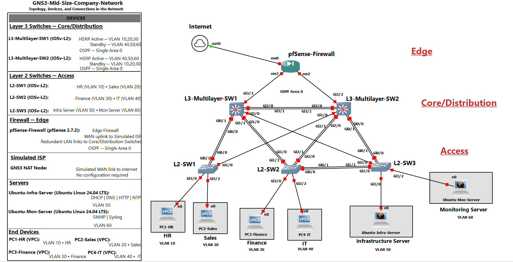

# Topology, Devices, and Connections in the Network

This section describes the design of the network, including the tiers, devices used, and how the devices are connected.

 

## Introduction

This lab simulates a mid-size single site company network with a collapsed core/distribution design. This network includes a ISP layer with a GNS3 NAT node simulating internet connectivity and handling NAT translation, an edge layer with a pfSense firewall connected to the
NAT node and redundant links to each core switch that handles firewall rules, a core/distrubution layer with two redundant layer 3 switches handling routing and network availability, an access layer with three layer 2 switches connecting to the layer 3 switches via trunk ports and to the end devices and
servers via access ports with VLAN segmentation, and an end device/server layer with department end devices, Ubuntu servers handling network services, and a management Admin PC with SSH access.

## Topology

## Network Tiers

### ISP

This consists of a GNS3 NAT node and simulates internet connectivity for the network and provides NAT translation. The NAT node connects to the WAN interface of the pfSense firewall and requires no configuration.

**Devices:** GNS3 NAT node 

### Edge

The edge consists of a pfSense firewall which provides firewall rules throughout the network and routes traffic to the simulated ISP. The WAN interface connects to the simulated ISP and the LAN interfaces connect to both core switches, providing redundancy. (Note: For true redundancy and high availability,
I would use a firewall pair with redundant connections to each other and two different ISP's, so if one goes down, it would automatically fail over to the other. However, that is outside the scope of this lab and I will only be using one simulated ISP.)

**Devices:** pfSense-Firewall

### Core/Distribution

This is a collapsed core design that consists of two layer 3 switches which run single area OSPF to provide routing for the network, HSRP per VLAN group to ensure high availability, and handles inter-VLAN routing. The core L3 switches are connected to each other via a trunk link and have redundant trunk links 
connected to each layer 2 access switch. Each Layer 3 switch also has an uplink to the pfSense Firewall.

**Devices:** L3-Multilayer-SW1, L3-Multilayer-SW2

### Access 

This tier consists of three layer 2 switches which hold the VLANs for the network, connect the end devices to the network, and ensure there are no switching loops using Rapid PVST+. The access switches are connected to the ethernet ports on each end device, server, and dedicated management Admin PC, and segment the departments through VLANs. 
Each layer 2 switch is connected to each layer 3 switch to ensure redundancy in the network in case their main link goes down. These switches run an EtherChannel bundle to their respective active L3 switch and a regular ethernet cable to their standby L3 switch to use fewer resources (see topology legend for
HSRP Active VLANs). There is also an EtherChannel bundle from L2-SW2 to L2-SW3 for the IT department to connect to servers.

**Devices:** L2-SW1, L2-SW2, L2-SW3

## Devices Used

| Device | Hostname | Image | Tier | Purpose |
|--------|----------|-------|------|---------|
| Simulated ISP | None | GNS3 NAT Node | ISP | Simulates internet connectivity - no configuration required |
| pfSense Firewall | pfSense-Firewall | pfSense 2.7.2 | Edge | Provides security using firewall rules and connects the internal network to the ISP on its WAN interface |
| Layer 3 Switch | L3-Multilayer-SW1 | IOSv-L2 | Core/Distribution | Routes traffic through the network and provide high availability using HSRP active on VLANs 10, 20, 30, 99 |
| Layer 3 Switch | L3-Multilayer-SW2 | IOSv-L2 | Core/Distribution | Routes traffic through the network and provide high availability using HSRP active on VLANs 40, 50, 60 |
| Layer 2 Switch | L2-SW1 | IOSv-L2 | Access | Provides layer 2 switching with access ports to the HR and Sales departments and trunk links to both core switches |
| Layer 2 Switch | L2-SW2 | IOSv-L2 | Access | Provides layer 2 switching with access ports to the Finance, IT, and Management VLANs and trunk links to both core switches |
| Layer 2 Switch | L2-SW3 | IOSv-L2 | Access | Provides layer 2 switching with access ports to the Infrastructure and Monitoring servers and trunk links to both core switches |
| PC | PC1-HR, PC2-Sales, PC3-Finance, PC4-IT | VPCS | End device | Workstations for each department (HR, Sales, Finance, IT) |
| Ubuntu Linux Server | Ubuntu-Admin-PC | Ubuntu 24.04 LTS (Noble Numbat) | Management | Management workstation with permitted SSH access to network switches |
| Ubuntu Linux Server | Ubuntu-Infra-Server | Ubuntu 24.04 LTS (Noble Numbat) | Server | Linux server providing DHCP, DNS, NTP, and HTTP |
| Ubuntu Linux Server | Ubuntu-Mon-Server | Ubuntu 24.04 LTS (Noble Numbat) | Server | Linux server providing SNMP and Syslog |

## Connections

### Single Link Connections

| Device | Interface | Connected to | Purpose |
|--------|-----------|--------------|---------|
| Simulated ISP | nat0 | em0 — pfSense-Firewall | WAN link to edge firewall |
| pfSense-Firewall | em0 | nat0 — Simulated ISP | WAN link to ISP |
| pfSense-Firewall | em2 | Gi3/2 — L3-Multilayer-SW2 | Connection to core switch |
| pfSense-Firewall | em3 | Gi3/3 — L3-Multilayer-SW1 | Connection to core switch |
| L3-Multilayer-SW1 | Gi2/0 | Gi2/0 — L2-SW3 | Standby trunk link for L2-SW3 |
| L3-Multilayer-SW1 | Gi3/3 | em3 — pfSense-Firewall | Uplink to edge firewall |
| L3-Multilayer-SW2 | Gi1/0 | Gi1/0 — L2-SW1 | Standby trunk link for L2-SW1 |
| L3-Multilayer-SW2 | Gi3/2 | em2 — pfSense-Firewall | Uplink to edge firewall |
| L2-SW1 | Gi1/0 | Gi1/0 — L3-Multilayer-SW2 | Failover link to L3-Multilayer-SW2 |
| L2-SW1 | Gi3/0 | e0 — PC1-HR | Access link for HR department PC |
| L2-SW1 | Gi3/2 | e0 — PC2-Sales | Access link for Sales department PC |
| L2-SW2 | Gi3/0 | e0 — PC3-Finance | Access link for Finance department PC |
| L2-SW2 | Gi3/2 | e0 — PC4-IT | Access link for IT department PC |
| L2-SW2 | Gi3/1 | e0 — Ubuntu-Admin-PC | Access link for management Admin PC |
| L2-SW3 | Gi2/0 | Gi2/0 — L3-Multilayer-SW1 | Failover link to L3-Multilayer-SW1 |
| L2-SW3 | Gi3/0 | e0 — Ubuntu-Infra-Server | Access link to infrastructure server |
| L2-SW3 | Gi3/2 | e0 — Ubuntu-Mon-Server | Access link to monitoring server |

### EtherChannel Bundles

| Device | Interface | Connected to | Purpose |
|--------|-----------|--------------|---------|
| L3-Multilayer-SW1 | Gi3/0 + Gi3/1 | Gi3/0 + Gi3/1 —  L3‑Multilayer‑SW2 | Peer link between core switches |
| L3-Multilayer-SW1 | Gi0/0 + Gi0/1 | Gi0/0 + Gi0/1 —  L2-SW1 | Main trunk link for VLAN 10 and 20 traffic |
| L3-Multilayer-SW1 | Gi1/0 + Gi1/1 | Gi1/0 + Gi1/1 —  L2-SW2 | Main trunk link for VLAN 30 traffic and backup for VLAN 40 traffic |
| L3-Multilayer-SW2 | Gi3/0 + Gi3/1 | Gi3/0 + Gi3/1 —  L3‑Multilayer‑SW1 | Peer link between core switches |
| L3-Multilayer-SW2 | Gi0/0 + Gi0/1 | Gi0/0 + Gi0/1 —  L2-SW3 | Main trunk link for VLAN 50 and 60 traffic |
| L3-Multilayer-SW2 | Gi2/0 + Gi2/1 | Gi2/0 + Gi2/1 — L2-SW2 | Main trunk link for VLAN 40 traffic and backup for VLAN 30 traffic |
| L2-SW1 | Gi0/0 + Gi0/1 | Gi0/0 + Gi0/1 — L3‑Multilayer‑SW1 | Uplink to L3-Multilayer-SW1 and main trunk link for VLAN 10 and 20 traffic |
| L2-SW2 | Gi0/0 + Gi0/1 | Gi1/0 + Gi1/1 — L2-SW3 | Connection for IT to servers traffic |
| L2-SW2 | Gi1/0 + Gi1/1 | Gi1/0 + Gi1/1 — L3‑Multilayer‑SW1 | Uplink to L3-Multilayer-SW1, main trunk link for VLAN 30, and backup for VLAN 40 |
| L2-SW2 | Gi2/0 + Gi2/1 | Gi2/0 + Gi2/1 — L3‑Multilayer‑SW2 | Uplink to L3-Multilayer-SW2, main trunk link for VLAN 40, and backup for VLAN 30 |
| L2-SW3 | Gi1/0 + Gi1/1 | Gi0/0 + Gi0/1 — L2-SW2 | Connection for servers to IT traffic |
| L2-SW3 | Gi0/0 + Gi0/1 | Gi0/0 + Gi0/1 — L3‑Multilayer‑SW2 | Uplink to L3-Multilayer-SW2 and main trunk link for VLAN 50 and 60 traffic |

