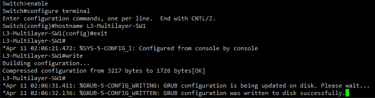
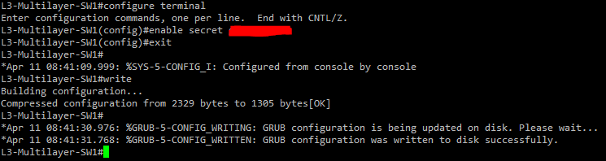
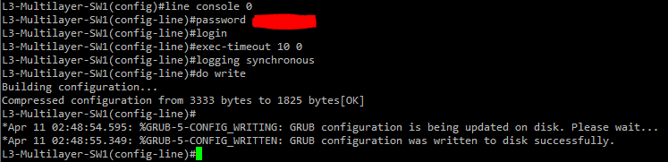
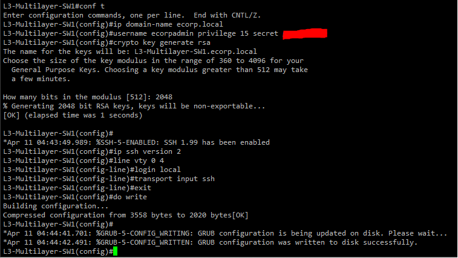
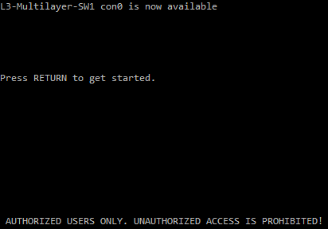
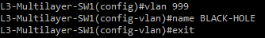
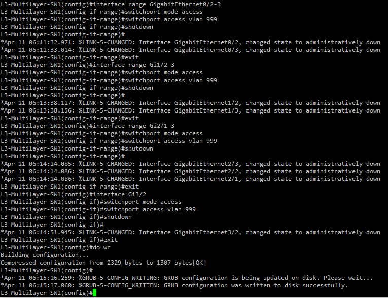
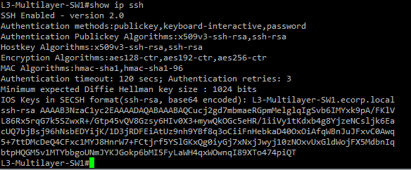
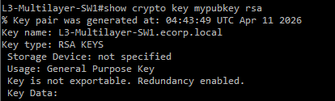
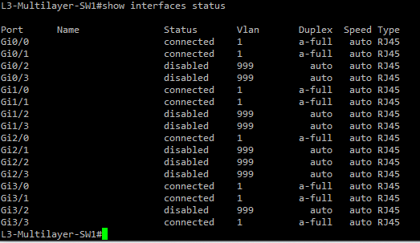

# Basic Device Configuration

This section covers the base configuration that must be applied to all five switches before any other configuration takes place. The basic configuration includes setting the hostname, setting up passwords, enabling SSH, configuring a login banner, and shutting down unused ports.
The devices these are configured on are L3-Multilayer-SW1, L3-Multilayer-SW2, L2-SW1, L2-SW2, and L2-SW3.

## Credentials in the lab

You can use any password you would like for this lab. Common passwords are not recommended for security purposes but for test environment purposes they are acceptable. However, it is recommended you use secure passwords to familiarize yourself with these practices. 

| Setting | Credential |
|---------|------------|
| Enable Secret | (your password) |
| Console Password | (your password) |
| VTY Password | (your password) |
| SSH Username | ecorpadmin | 
| SSH Password | (your password) |
| SSH Domain Name | ecorp.local |

**Note:** I will be using the same password across all devices for simplicity of the lab. A real environment would require unique passwords for each device, or a centralized authentication system like TACACS+ or RADIUS.

## Setting the Hostname 

The hostname is configured on each device to ensure you know which device you are currently configuring. The hostname should be configured on each device and match the topology.

### Commands:
```
enable
configure terminal
hostname L3-Multilayer-SW1
exit
write memory

```
**Note:** Write Memory can be shortened to write or wr. If you are in any configuration mode, the command must be 'do write'. This saves the configuration so it will stay after the device reloads.




| Device | Hostname |
|--------|----------|
| Layer 3 Core Switch 1 | L3-Multilayer-SW1 |
| Layer 3 Core Switch 2 | L3-Multilayer-SW2 |
| Layer 2 Access Switch 1 | L2-SW1 |
| Layer 2 Access Switch 2 | L2-SW2 |
| Layer 2 Access Switch 3 | L2-SW3 |

## Setting the Enable Secret and Encrypting Passwords

The enable secret encrypts the privileged EXEC password using MD5 (Type 5). Apply to each switch.

### Commands: 

```
enable secret P@ssw0rd!
exit
write memory
```
**Note:** "P@ssw0rd!" is the password of your choosing.



Password is covered for security purposes.

## Configuring the Console Line

We will secure the console port using a password, set the session timeout to 10 minutes of inactivity, and disable syslog messages to avoid typing disruption. The console password is plaintext by default so service password-encryption applies Type 7 encryption to it. Type 7 is a very weak encryption algorithm so in a production environment you would use login local instead to authenticate against the MD5 encrypted local user database. This lab uses a separate console password to avoid a dependency on the SSH username which is configured in the next step.
Apply to each switch.

### Commands:

```
service password-encryption
line console 0
password P@ssw0rd!
login
exec-timeout 10 0
logging synchronous
```
**Note:** "P@ssw0rd!" is the password of your choosing.



## Configuring SSH

SSH allows the secure remote access from the Ubuntu-Admin-PC. Privilege 15 grants full administrative access and secret encrypts the password so it is not stored in plaintext. Apply this to each switch to allow SSH access.

### Commands: 

```
ip domain-name ecorp.local
username ecorpadmin privilege 15 secret P@ssw0rd!
crypto key generate rsa (choose 2048 bits when prompted)
ip ssh version 2
```
**Then configure the VTY lines for SSH:**

```
line vty 0 4
login local
transport input ssh
exit
do write
```



## Configuring the Login Banner

The banner is displayed before you login to the device and is a legal warning to display that access is for authorized users only. You should never use welcoming language. Apply this to each switch.

### Commands: 

```
banner motd # AUTHORIZED USERS ONLY. UNAUTHORIZED ACCESS IS PROHIBITED! #
```
**Note:** The message should begin and end with a special character

**Optional - clear default banners by using:**
```
no banner exec
no banner login
no banner incoming
```

To confirm that this worked, log out of the switch and before you enter your password you should see the banner.



## Shutting down unused ports

For security purposes, unused ports are administratively shut down and put into an unused VLAN so unauthorized devices cannot gain access from that unused port. This is applied to each unused port on each switch.

**Create the black hole VLAN:**

Create this vlan on every switch.

```
vlan 999
name BLACK-HOLE
exit
```


**Putting the unused ports into the black hole VLAN and shut them down:**

**Note:** We will remove vlan 999 from the allowed vlan list in section 04.

Identify which ports are not being used and include them. For the example, we are using Gi0/2 and Gi0/3 so the range will be 0/2-3. APPLY THIS TO EVERY UNUSED PORT ON EVERY SWITCH.
```
interface range GigabitEthernet0/2-3
switchport mode access
switchport access vlan 999
shutdown
exit
do write
```
**Note:** For L3-Multilayer-SW1, the unused ports we shut down are: Gi0/2, Gi0/3, Gi1/2, Gi1/3, Gi2/1, Gi2/2, Gi2/3, Gi3/2.




## Verification

After completing the commands above, you must verify that the configuration was applied correctly.

**Verify general configs:**

```
show running-config
```
*If in a configuration mode you must put 'do show running-config'*

Verify:
- Correct hostname
- Enable secret is configured
- Banner motd shows the correct message
- Console and VTY lines show correct values with encrypted passwords

**Verify SSH is enabled:**

```
show ip ssh
```


**Verify SSH key was created sucessfully:**
```
show crypto key mypubkey rsa
```


**Verify unused ports are shut down:**

```
show interfaces status
```
Verify:
- Status is disabled
- Vlan is 999



### L3-Multilayer-SW1 complete configuration

After doing a show running-config, L3-Multilayer-SW1 should include everything we just configured and show this:

**Service password-encryption to encrypt the console password:**
```
service password-encryption
```

**Hostname with the hostname of the device:**
```
!
hostname L3-Multilayer-SW1
!
```

**The enable secret and encrypted password:**
```
!
enable secret 5 [MD5-hash]
```

**SSH username, privilege, encrypted password, and domain name:**
```
!
username ecorpadmin privilege 15 secret 5 [MD5-hash]
no aaa new-model
!
!
ip domain-name ecorp.local
```
**The unused interfaces shut down and in vlan 999:**
```
!
interface GigabitEthernet0/2
 switchport access vlan 999
 switchport mode access
 shutdown
 negotiation auto
!
interface GigabitEthernet0/3
 switchport access vlan 999
 switchport mode access
 shutdown
 negotiation auto
!
```
**SSH version 2 and encryption algorithms:**
```
ip ssh version 2
ip ssh server algorithm encryption aes128-ctr aes192-ctr aes256-ctr
ip ssh client algorithm encryption aes128-ctr aes192-ctr aes256-ctr
```
**Correct banner:**
```
!
banner motd ^C AUTHORIZED USERS ONLY. UNAUTHORIZED ACCESS IS PROHIBITED! ^C
```
**Console and VTY lines settings:**
```
!
line con 0
 password 7 [type 7 encrypted password]
 logging synchronous
 login
line aux 0
line vty 0 4
 login local
 transport input ssh
!
```
