# VLAN Configuration and Port Security

VLANs divide the network into logical segments to isolate department traffic and improve network performance and security. This section covers the VLAN configuration for all five switches. This includes creating VLANs, configuring trunk ports, configuring access ports, and enabling port security on access ports. VLANs must be created and configured before any routing or switching protocols are configured in later sections.

<br>

## Creating the VLANs

VLANs must be created on every switch in the network. Even though the L3 switches handle routing, they still need VLANs created to pass traffic across trunk links. 

Apply to each switch.

**Commands:**
```
enable
configure terminal

vlan 10
name HR
vlan 20
name SALES
vlan 30
name FINANCE
vlan 40
name IT
vlan 50
name INFRASTRUCTURE
vlan 60
name MONITORING
vlan 99
name MANAGEMENT
vlan 666
name NATIVE
exit
do write
```
**Note:** If you did not configure the black hole vlan from section 03, create VLAN 999 and name it BLACK-HOLE

**Verify the VLANs were created using:**
```
show vlan brief
```
Each VLAN should be listed with the correct number and name. If it does not include one of the VLANs, just create it again. The status of each VLAN should be active. The unused ports should be listed under BLACK-HOLE as configured in section 03.

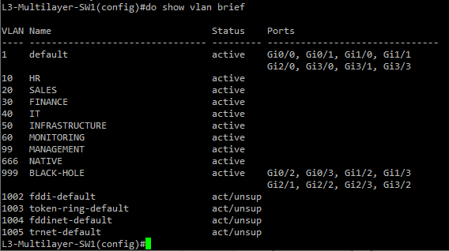

## Configuring the Single Trunk Ports

Trunk ports carry traffic for multiple VLANs between the switches. All trunk ports use VLAN 666 as the native VLAN and allow only the active VLANs. Using VLAN 1 as the native VLAN is a security risk and could allow VLAN hopping attacks that exploit the default native VLAN, so we remove it from each trunk link. We also remove VLAN 999 because the unused ports are in this VLAN and should never cross a trunk link.

This section only includes the single link trunk port configuration. The EtherChannel interfaces are configured and trunked in section 05. Do not configure any of the individual EtherChannel interfaces yet.

### L3-Multilayer-SW1 Single Trunk Ports:
```
enable
configure terminal

interface Gi2/0
switchport trunk encapsulation dot1q
switchport mode trunk
switchport trunk allowed vlan 10,20,30,40,50,60,99,666
switchport trunk allowed vlan remove 1
switchport trunk allowed vlan remove 999
switchport trunk native vlan 666
no shutdown
exit
do write
```
**Note:** After configuring the 'switchport trunk native vlan 666' command, you will get an error because the native VLAN is not the same on both sides of the link. Once you configure the native VLAN on L2-SW3 Gi2/0, the error will clear and STP will unblock the port.

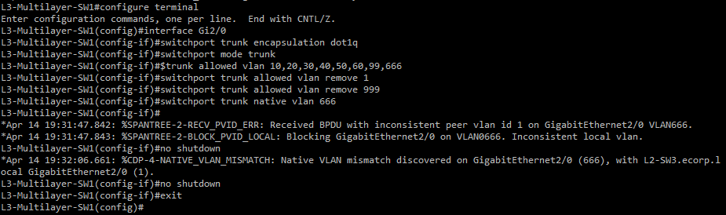

### L3-Multilayer-SW2 Single Trunk Ports:
```
enable
configure terminal

interface Gi1/0
switchport trunk encapsulation dot1q
switchport mode trunk
switchport trunk allowed vlan 10,20,30,40,50,60,99,666
switchport trunk allowed vlan remove 1
switchport trunk allowed vlan remove 999
switchport trunk native vlan 666
no shutdown
exit
do write
```

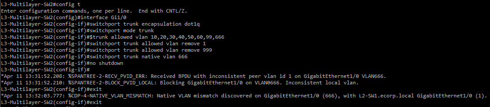

### L2-SW1 Single Trunk Ports:
```
enable
configure terminal

interface Gi1/0
switchport trunk encapsulation dot1q
switchport mode trunk
switchport trunk allowed vlan 10,20,30,40,50,60,99,666
switchport trunk allowed vlan remove 1
switchport trunk allowed vlan remove 999
switchport trunk native vlan 666
no shutdown
exit
do write
```

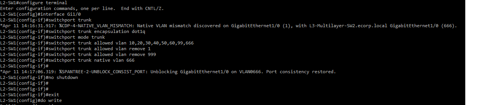

### L2-SW3 Single Trunk Ports:
```
enable
configure terminal

interface Gi2/0
switchport trunk encapsulation dot1q
switchport mode trunk
switchport trunk allowed vlan 10,20,30,40,50,60,99,666
switchport trunk allowed vlan remove 1
switchport trunk allowed vlan remove 999
switchport trunk native vlan 666
no shutdown
exit
do write
```
**Note:** Since we updated the native vlan on both L3-Multilayer-SW1 Gi2/0 and L2-SW3 Gi2/0, the error from before will clear on each switch and STP will unblock the port on both sides. You can see the port consistency restored message in the image below after setting the native VLAN.

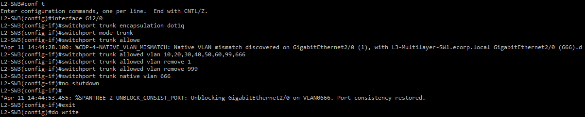


### Verify Trunk Ports:

On each switch, use this command to verify information about the trunk ports:
```
show interfaces trunk
```
Verify:

 - The mode shows on
 - The status is trunking
 - The native VLAN is 666
 - The allowed VLANs are 10,20,30,40,50,60,99,666
 - The allowed list does NOT show VLAN 1 and 999

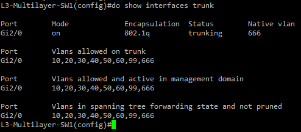

### Common Trunk Port Problems:

| Problem | Fix | 
|---------|-----|
| Active VLANs are missing from allowed list | Run "switchport trunk allowed vlan add [vlan id]" on the affected interface |
| VLAN 1 or 999 is in the allowed list | Run "switchport trunk allowed vlan remove 1" and "switchport trunk allowed vlan remove 999" on the affected interface |
| Status does not show trunking | Verify encapsulation is set to dot1q using "show interfaces [interface] switchport". If not, rerun "switchport trunk encapsulation dot1q" and then "switchport mode trunk" on that interface |

## Configuring Access Ports

Access ports connect the end devices and servers to the network. Each interface that faces the end devices and servers is configured as an access port and assigned the VLAN of the department/server it is connected to. These are only applied to the layer 2 access switches.

### L2-SW1 Access Ports:
```
enable
configure terminal

interface Gi3/0
switchport mode access
switchport access vlan 10
no shutdown
exit

interface Gi3/2
switchport mode access
switchport access vlan 20
no shutdown
exit
do write
```
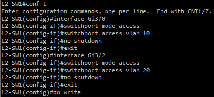

### L2-SW2 Access Ports:
```
enable
configure terminal

interface Gi3/0
switchport mode access
switchport access vlan 30
no shutdown
exit

interface Gi3/2
switchport mode access
switchport access vlan 40
no shutdown
exit

interface Gi3/1
switchport mode access
switchport access vlan 99
no shutdown
exit
do write
```
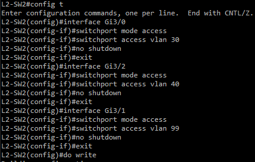

### L2-SW3 Access Ports:
```
enable
configure terminal

interface Gi3/0
switchport mode access
switchport access vlan 50
no shutdown
exit

interface Gi3/2
switchport mode access
switchport access vlan 60
no shutdown
exit
do write
```

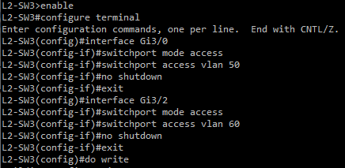

### Verify Access Ports:

To verify the correct port is in the correct VLAN, you use:
```
show vlan brief
```
The access ports should be listed under the correct VLAN. For now, the ports used for EtherChannel should be listed in VLAN 1.

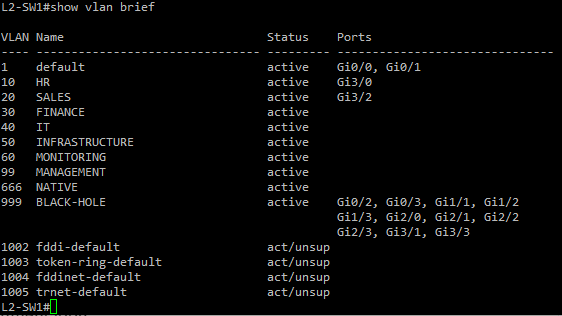

To verify each access port, you use:
```
show interfaces [interface] switchport
```
Verify the administrative mode shows static access and the access mode VLAN shows the correct VLAN

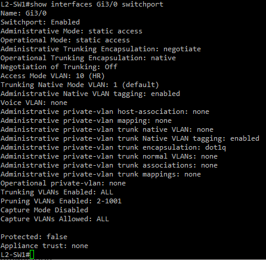

### Common Access Port Problems

| Problem | Fix |
|---------|-----|
| Access port is not coming up | Rerun "No shutdown" on the affected interface |
| Access port is not in the correct VLAN | Rerun "switchport access vlan [id]" on the affected interface |

## Configuring Port Security

Port security is configured on all access ports to prevent unauthorized devices from connecting to the network. For this lab, each access port will allow a maximum of one MAC address, since only one device is connected. If a port security violation occurs, the port will shut down immediately. Sticky MAC automatically records the MAC address of the connected device when it first sends traffic.

Only apply to the access ports.

### L2-SW1 Port Security:
```
enable
configure terminal

interface Gi3/0
switchport port-security
switchport port-security maximum 1
switchport port-security mac-address sticky
switchport port-security violation shutdown
exit

interface Gi3/2
switchport port-security
switchport port-security maximum 1
switchport port-security mac-address sticky
switchport port-security violation shutdown
exit
do write
```

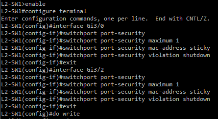

### L2-SW2 Port Security:
```
enable
configure terminal

interface Gi3/0
switchport port-security
switchport port-security maximum 1
switchport port-security mac-address sticky
switchport port-security violation shutdown
exit

interface Gi3/1
switchport port-security
switchport port-security maximum 1
switchport port-security mac-address sticky
switchport port-security violation shutdown
exit

interface Gi3/2
switchport port-security
switchport port-security maximum 1
switchport port-security mac-address sticky
switchport port-security violation shutdown
exit
do write
```
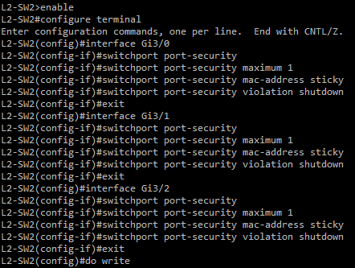

### L2-SW3 Port Security:
```
enable
configure terminal

interface Gi3/0
switchport port-security
switchport port-security maximum 1
switchport port-security mac-address sticky
switchport port-security violation shutdown
exit

interface Gi3/2
switchport port-security
switchport port-security maximum 1
switchport port-security mac-address sticky
switchport port-security violation shutdown
exit
do write
```
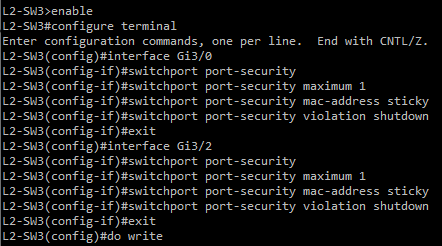

### Verify Port Security:

To verify port security status, use
```
show port-security
```
Verify:
- Secure port shows the correct access ports
- Max MAC addresses shows 1
- Security Action shows Shutdown

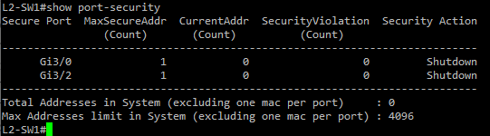

To view MAC addresses captured, use
```
show port-security address
```
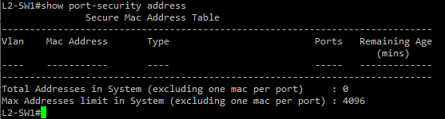

**Note:** Since the devices have not sent traffic, there will be no MAC addresses captured yet.

### Common Port Security Problems:

| Problem | Fix |
|---------|-----|
| Port security is not getting applied | Verify port is in access mode first as port security only works on access ports |
| Multiple MAC addresses showing on a port configured for maximum 1 | Port security is not enabled. Rerun "switchport port-security" on the affected interface |
| Port shows secure-down instead of secure-up | The port may be administratively shut down. Bring it back up with "no shutdown" | 

### Port shutting down from a violation

A port shutdown from a violation enters err-disabled state because the switch disabled it automatically as a security response. It will not come back up on its own, you must manually bring it back up. To do this, run:
```
enable
configure terminal

interface Gi[affected port]
shutdown
no shutdown
exit
```


