# EtherChannel and Spanning Tree Configuration

This section covers the EtherChannel and Spanning Tree configuration for all five switches. EtherChannel bundles multiple physical links into one logical link to provide increased bandwidth. Spanning Tree Protocol (STP) prevents layer 2 loops in the network by blocking paths on redundant links.
Since this network has multiple links to each switch, we will need to implement STP.

EtherChannel must be configured before STP so that STP can make the correct forwarding decisions based on the port-channel interfaces instead of the individual ports. 

## EtherChannel Bundles List

All six EtherChannel bundles use LACP (Link Aggregation Control Protocol). LACP is the protocol that negotiates the bundle between two switches. One side of the link is active and the other is passive. Active initiates the negotiation and passive responds to it so at least one side must be active for the bundle to form.

| Bundle | Device A | Interfaces | Device B | Interfaces | Purpose |
|--------|----------|------------|----------|------------|---------|
| Po1 | L3-Multilayer-SW1 | Gi3/0 + Gi3/1 | L3-Multilayer-SW2 | Gi3/0 + Gi3/1 | Core peer link |
| Po2 | L3-Multilayer-SW1 | Gi0/0 + Gi0/1 | L2-SW1 | Gi0/0 + Gi0/1 | Core to access uplink |
| Po3 | L3-Multilayer-SW1 | Gi1/0 + Gi1/1 | L2-SW2 | Gi1/0 + Gi1/1 | Core to access uplink |
| Po4 | L3-Multilayer-SW2 | Gi2/0 + Gi2/1 | L2-SW2 | Gi2/0 + Gi2/1 | Core to access uplink |
| Po5 | L3-Multilayer-SW2 | Gi0/0 + Gi0/1 | L2-SW3 | Gi0/0 + Gi0/1 | Core to access uplink |
| Po6 | L2-SW2 | Gi0/0 + Gi0/1 | L2-SW3 | Gi1/0 + Gi1/1 | IT to servers link |

## Configuring EtherChannel

Each EtherChannel bundle must be configured on both ends of the link. The ports in the bundle are added to a channel group and the port-channel interface is then configured as a trunk. Do not configure trunk settings on the individual ports in the bundle, configure them on the port-channel interface only. 

For this lab, the layer 3 core switches will be the active side and the layer 2 access switches will be the passive side. For the link between the layer 3 switches, L3-Multilayer-SW1 will be the active side and L3-Multilayer-SW2 will be the passive side. For the link between the two layer 2 switches, L2-SW2 will be the active side and L2-SW3 will be the passive side.

The channel-group number on each end of a bundle must match. If the numbers do not match the bundle will not form. For example, L3-Multilayer-SW1 and L2-SW1 will both use channel-group 2 on the link between them. When you create the channel-group with a number, it creates a port-channel interface with that same number in which you will configure the trunk settings on. 

### L3-Multilayer-SW1:

**Note:** The port-channel/channel-group number with the device and interfaces is listed in the table above as Po1, Po2, etc.

**Creating the channel groups:**
```
enable
configure terminal
interface range Gi3/0-1
channel-group 1 mode active
no shutdown
exit

interface range Gi0/0-1
channel-group 2 mode active
no shutdown
exit

interface range Gi1/0-1
channel group 3 mode active
no shutdown
exit
```
**Note:** Until the channel group has been configured on the other side, LACP cannot negotiate the bundle and you will get a message. That is okay, and it will clear once you configure the other side.

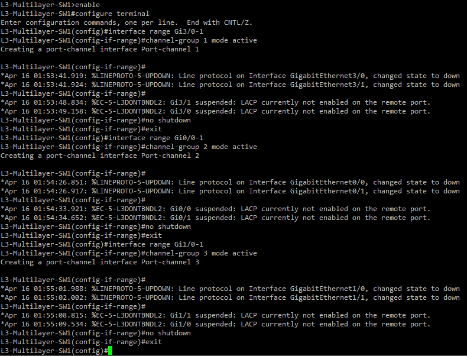

**Trunking the port channels:**
```
interface port-channel 1
switchport trunk encapsulation dot1q
switchport mode trunk
switchport trunk allowed vlan 10,20,30,40,50,60,99,666
switchport trunk allowed vlan remove 1
switchport trunk allowed vlan remove 999
switchport trunk native vlan 666
no shutdown
exit

interface port-channel 2
switchport trunk encapsulation dot1q
switchport mode trunk
switchport trunk allowed vlan 10,20,30,40,50,60,99,666
switchport trunk allowed vlan remove 1
switchport trunk allowed vlan remove 999
switchport trunk native vlan 666
no shutdown
exit

interface port-channel 3
switchport trunk encapsulation dot1q
switchport mode trunk
switchport trunk allowed vlan 10,20,30,40,50,60,99,666
switchport trunk allowed vlan remove 1
switchport trunk allowed vlan remove 999
switchport trunk native vlan 666
no shutdown
exit
do write
```
The messages the console sends can clog up the screen so for the example screenshot I will only show the configuration of port-channel 1. Configure port-channel 2 and 3.

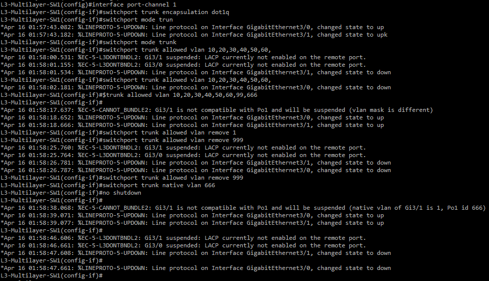

### L3-Multilayer-SW2:

**Creating the channel groups:**

```
enable
configure terminal
interface range Gi3/0-1
channel-group 1 mode passive
no shutdown
exit

interface range Gi2/0-1
channel-group 4 mode active
no shutdown
exit

interface range Gi0/0-1
channel-group 5 mode active
no shutdown
exit
```
Again, the native vlan mismatch messages will clog up the screen so the example screenshot will only show creation of channel group 4 and 5.

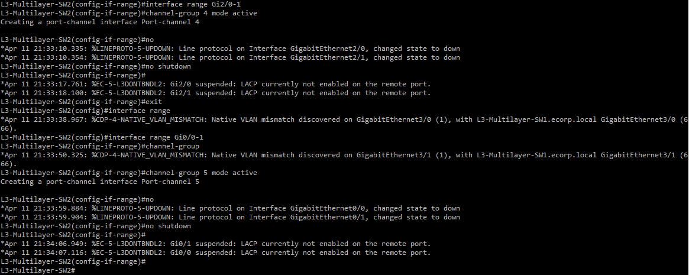

**Trunking the port channels:**
```
interface port-channel 1
switchport trunk encapsulation dot1q
switchport mode trunk
switchport trunk allowed vlan 10,20,30,40,50,60,99,666
switchport trunk allowed vlan remove 1
switchport trunk allowed vlan remove 999
switchport trunk native vlan 666
no shutdown
exit

interface port-channel 4
switchport trunk encapsulation dot1q
switchport mode trunk
switchport trunk allowed vlan 10,20,30,40,50,60,99,666
switchport trunk allowed vlan remove 1
switchport trunk allowed vlan remove 999
switchport trunk native vlan 666
no shutdown
exit

interface port-channel 5
switchport trunk encapsulation dot1q
switchport mode trunk
switchport trunk allowed vlan 10,20,30,40,50,60,99,666
switchport trunk allowed vlan remove 1
switchport trunk allowed vlan remove 999
switchport trunk native vlan 666
no shutdown
exit
do write
```
The example screenshot will only show port-channel 1 and 4.

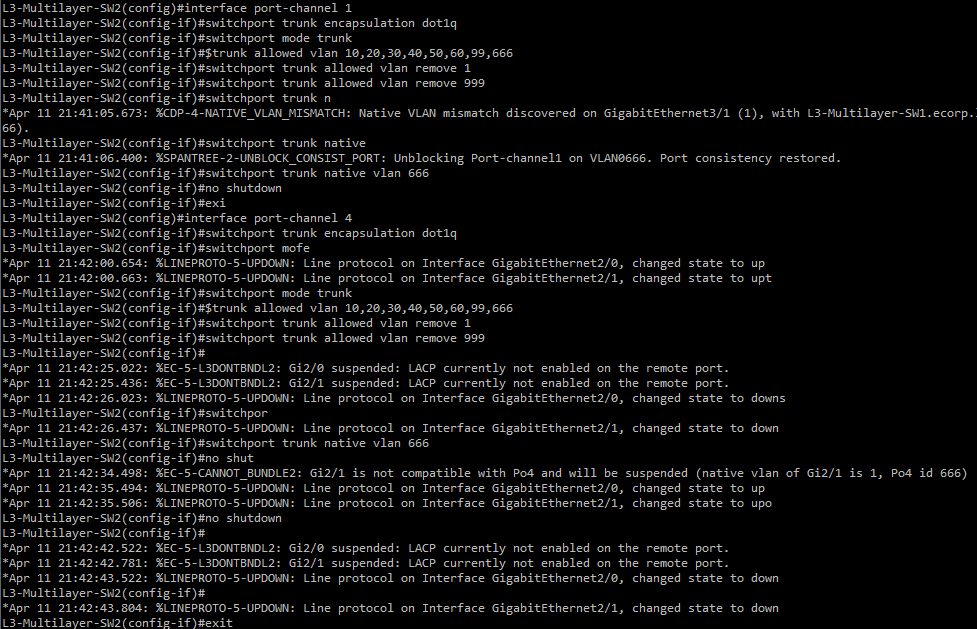

### L2-SW1: 

**Creating the channel groups:**
```
enable
configure terminal
interface range Gi0/0-1
channel-group 2 mode passive
no shutdown
exit
```

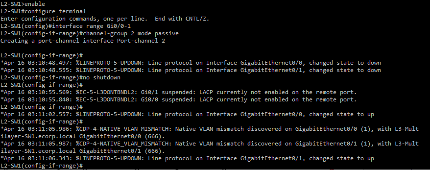

**Trunking the port channels:**
```
interface port-channel 2
switchport trunk encapsulation dot1q
switchport mode trunk
switchport trunk allowed vlan 10,20,30,40,50,60,99,666
switchport trunk allowed vlan remove 1
switchport trunk allowed vlan remove 999
switchport trunk native vlan 666
no shutdown
exit
do write
```

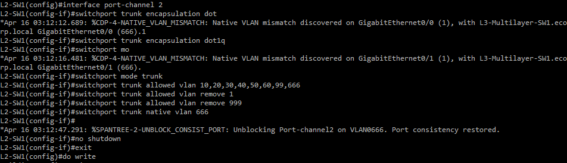

### L2-SW2: 

**Creating the channel groups:**
```
enable
configure terminal
interface range GigabitEthernet1/0-1
 channel-group 3 mode passive
 no shutdown
exit

interface range GigabitEthernet2/0-1
 channel-group 4 mode passive
 no shutdown
exit

interface range GigabitEthernet0/0-1
 channel-group 6 mode active
 no shutdown
exit
```
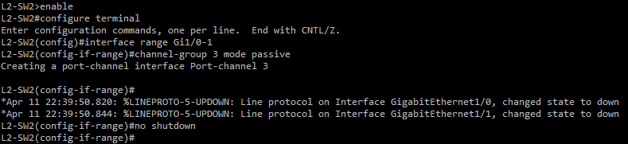
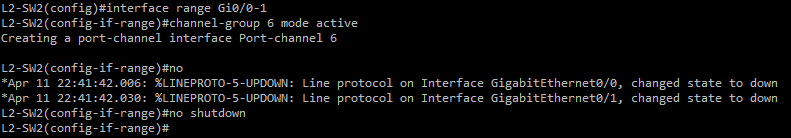

**Trunking the port channels:**
```
interface port-channel 3
switchport trunk encapsulation dot1q
switchport mode trunk
switchport trunk allowed vlan 10,20,30,40,50,60,99,666
switchport trunk allowed vlan remove 1
switchport trunk allowed vlan remove 999
switchport trunk native vlan 666
no shutdown
exit

interface port-channel 4
switchport trunk encapsulation dot1q
switchport mode trunk
switchport trunk allowed vlan 10,20,30,40,50,60,99,666
switchport trunk allowed vlan remove 1
switchport trunk allowed vlan remove 999
switchport trunk native vlan 666
no shutdown
exit

interface port-channel 6
switchport trunk encapsulation dot1q
switchport mode trunk
switchport trunk allowed vlan 40,50,60,99,666
switchport trunk allowed vlan remove 1
switchport trunk allowed vlan remove 999
switchport trunk native vlan 666
no shutdown
exit
do write
```
**Note:** Po6 is the only bundle with a limited allowed VLAN list, VLANs 40, 50, 60, 99, and 666. This link is specifically for IT department to server communication. Other departments are not included because this link only carries traffic between the IT department and servers.

Port-channel 3 and 4:

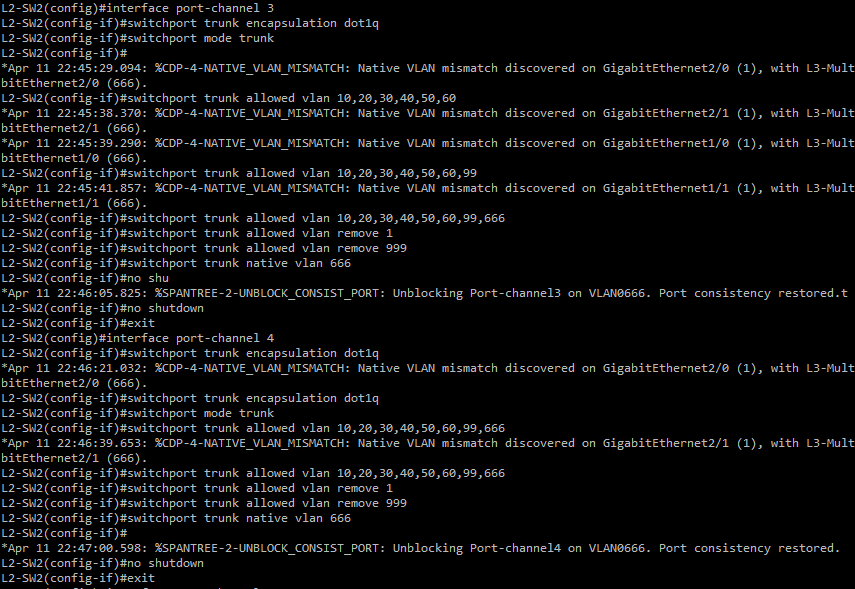

Port-channel 6:

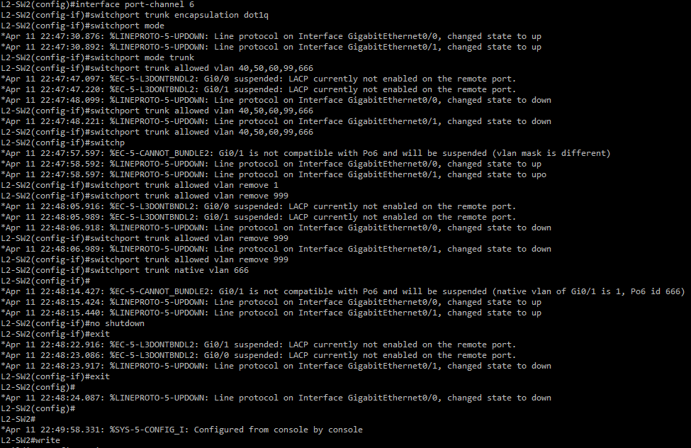

### L2-SW3

**Creating the channel groups:**
```
enable
configure terminal
interface range GigabitEthernet0/0-1
 channel-group 5 mode passive
 no shutdown
exit

interface range GigabitEthernet1/0-1
 channel-group 6 mode passive
 no shutdown
exit
```
Creating channel group 5:

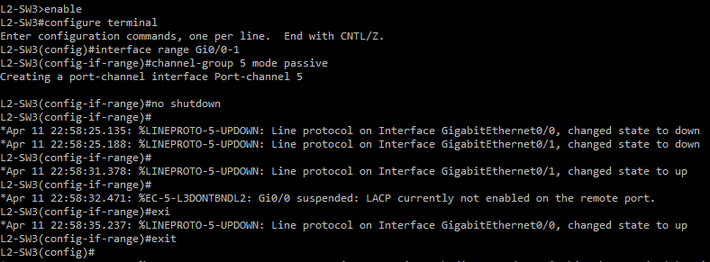

**Trunking the port channels:**
```
interface port-channel 5
switchport trunk encapsulation dot1q
switchport mode trunk
switchport trunk allowed vlan 10,20,30,40,50,60,99,666
switchport trunk allowed vlan remove 1
switchport trunk allowed vlan remove 999
switchport trunk native vlan 666
no shutdown
exit

interface port-channel 6
switchport trunk encapsulation dot1q
switchport mode trunk
switchport trunk allowed vlan 40,50,60,99,666
switchport trunk allowed vlan remove 1
switchport trunk allowed vlan remove 999
switchport trunk native vlan 666
no shutdown
exit
do write
```
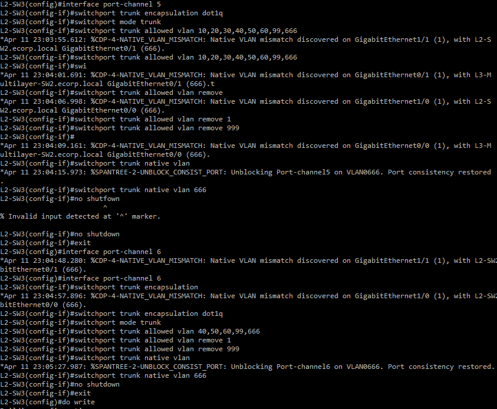
