# EtherChannel and Spanning Tree Configuration

This section covers the EtherChannel and Spanning Tree configuration for all five switches. EtherChannel is the bundling of multiple physical links into one logical link to provide increased bandwidth. Spanning Tree Protocol (STP) prevents layer 2 loops in the network by blocking paths on redundant links.
Since this network has multiple links to each switch, we will need to implement STP. We will also be configuring PortFast and BPDU guard.

EtherChannel must be configured before STP so that STP can make the correct forwarding decisions based on the port-channel interfaces instead of the individual ports. 

## EtherChannel Bundles List

All six EtherChannel bundles use LACP (Link Aggregation Control Protocol). LACP is the protocol that negotiates the bundle between two switches. One side of the link is active and the other is passive. Active initiates the negotiation and passive responds to it, so at least one side must be active for the bundle to form.

| Bundle | Device A | Interfaces | Device B | Interfaces | Purpose |
|--------|----------|------------|----------|------------|---------|
| Po1 | L3-Multilayer-SW1 | Gi3/0 + Gi3/1 | L3-Multilayer-SW2 | Gi3/0 + Gi3/1 | Core peer link |
| Po2 | L3-Multilayer-SW1 | Gi0/0 + Gi0/1 | L2-SW1 | Gi0/0 + Gi0/1 | Core to access uplink |
| Po3 | L3-Multilayer-SW1 | Gi1/0 + Gi1/1 | L2-SW2 | Gi1/0 + Gi1/1 | Core to access uplink |
| Po4 | L3-Multilayer-SW2 | Gi2/0 + Gi2/1 | L2-SW2 | Gi2/0 + Gi2/1 | Core to access uplink |
| Po5 | L3-Multilayer-SW2 | Gi0/0 + Gi0/1 | L2-SW3 | Gi0/0 + Gi0/1 | Core to access uplink |
| Po6 | L2-SW2 | Gi0/0 + Gi0/1 | L2-SW3 | Gi1/0 + Gi1/1 | IT to servers link |

## Configuring EtherChannel

Each EtherChannel bundle must be configured on both ends of the link. The ports in the bundle are added to a channel group and the port-channel interface is then configured as a trunk. Do not configure trunk settings on the individual ports in the bundle, configure them on the port-channel interface only. 

For this lab, the layer 3 core switches will be the active side and the layer 2 access switches will be the passive side. For the link between the layer 3 switches, L3-Multilayer-SW1 will be the active side and L3-Multilayer-SW2 will be the passive side. For the link between the two layer 2 switches, L2-SW2 will be the active side and L2-SW3 will be the passive side.

The channel-group number on each end of a bundle must match. If the numbers do not match the bundle will not form. For example, L3-Multilayer-SW1 and L2-SW1 will both use channel-group 2 on the link between them. When you create the channel-group with a number, it creates a port-channel interface with that same number in which you will configure the trunk settings on. 

### L3-Multilayer-SW1:

**Note:** The port-channel/channel-group number with the device and interfaces is listed in the table above as Po1, Po2, etc. Use that table to create the channel-groups.

**Creating the channel groups:**
```
enable
configure terminal
interface range Gi3/0-1
channel-group 1 mode active
no shutdown
exit

interface range Gi0/0-1
channel-group 2 mode active
no shutdown
exit

interface range Gi1/0-1
channel-group 3 mode active
no shutdown
exit
```
**Note:** Until the channel group has been configured on the other side, LACP cannot negotiate the bundle and you will get a message. That is okay, and it will clear once you configure the other side.


**Trunking the port channels:**
```
interface port-channel 1
switchport trunk encapsulation dot1q
switchport mode trunk
switchport trunk allowed vlan 10,20,30,40,50,60,99,666
switchport trunk allowed vlan remove 1
switchport trunk allowed vlan remove 999
switchport trunk native vlan 666
no shutdown
exit

interface port-channel 2
switchport trunk encapsulation dot1q
switchport mode trunk
switchport trunk allowed vlan 10,20,30,40,50,60,99,666
switchport trunk allowed vlan remove 1
switchport trunk allowed vlan remove 999
switchport trunk native vlan 666
no shutdown
exit

interface port-channel 3
switchport trunk encapsulation dot1q
switchport mode trunk
switchport trunk allowed vlan 10,20,30,40,50,60,99,666
switchport trunk allowed vlan remove 1
switchport trunk allowed vlan remove 999
switchport trunk native vlan 666
no shutdown
exit
do write
```
The messages the console sends can clog up the screen so for the example screenshot I will only show the configuration of port-channel 1. Configure port-channel 2 and 3.


### L3-Multilayer-SW2:

**Creating the channel groups:**

```
enable
configure terminal
interface range Gi3/0-1
channel-group 1 mode passive
no shutdown
exit

interface range Gi2/0-1
channel-group 4 mode active
no shutdown
exit

interface range Gi0/0-1
channel-group 5 mode active
no shutdown
exit
```
Again, the messages will clog up the screen so the example screenshot will only show creation of channel group 4 and 5.


**Trunking the port channels:**
```
interface port-channel 1
switchport trunk encapsulation dot1q
switchport mode trunk
switchport trunk allowed vlan 10,20,30,40,50,60,99,666
switchport trunk allowed vlan remove 1
switchport trunk allowed vlan remove 999
switchport trunk native vlan 666
no shutdown
exit

interface port-channel 4
switchport trunk encapsulation dot1q
switchport mode trunk
switchport trunk allowed vlan 10,20,30,40,50,60,99,666
switchport trunk allowed vlan remove 1
switchport trunk allowed vlan remove 999
switchport trunk native vlan 666
no shutdown
exit

interface port-channel 5
switchport trunk encapsulation dot1q
switchport mode trunk
switchport trunk allowed vlan 10,20,30,40,50,60,99,666
switchport trunk allowed vlan remove 1
switchport trunk allowed vlan remove 999
switchport trunk native vlan 666
no shutdown
exit
do write
```
The example screenshot will only show port-channel 1 and 4.


### L2-SW1: 

**Creating the channel groups:**
```
enable
configure terminal
interface range Gi0/0-1
channel-group 2 mode passive
no shutdown
exit
```


**Trunking the port channels:**
```
interface port-channel 2
switchport trunk encapsulation dot1q
switchport mode trunk
switchport trunk allowed vlan 10,20,30,40,50,60,99,666
switchport trunk allowed vlan remove 1
switchport trunk allowed vlan remove 999
switchport trunk native vlan 666
no shutdown
exit
do write
```


### L2-SW2: 

**Creating the channel groups:**
```
enable
configure terminal
interface range GigabitEthernet1/0-1
 channel-group 3 mode passive
 no shutdown
exit

interface range GigabitEthernet2/0-1
 channel-group 4 mode passive
 no shutdown
exit

interface range GigabitEthernet0/0-1
 channel-group 6 mode active
 no shutdown
exit
```


**Trunking the port channels:**
```
interface port-channel 3
switchport trunk encapsulation dot1q
switchport mode trunk
switchport trunk allowed vlan 10,20,30,40,50,60,99,666
switchport trunk allowed vlan remove 1
switchport trunk allowed vlan remove 999
switchport trunk native vlan 666
no shutdown
exit

interface port-channel 4
switchport trunk encapsulation dot1q
switchport mode trunk
switchport trunk allowed vlan 10,20,30,40,50,60,99,666
switchport trunk allowed vlan remove 1
switchport trunk allowed vlan remove 999
switchport trunk native vlan 666
no shutdown
exit

interface port-channel 6
switchport trunk encapsulation dot1q
switchport mode trunk
switchport trunk allowed vlan 40,50,60,99,666
switchport trunk allowed vlan remove 1
switchport trunk allowed vlan remove 999
switchport trunk native vlan 666
no shutdown
exit
do write
```
**Note:** Po6 is the only bundle with a limited allowed VLAN list, VLANs 40, 50, 60, 99, and 666. This link is specifically for IT department to server communication. Other departments are not included because this link only carries traffic between the IT department and servers.

Port-channel 3 and 4:


Port-channel 6:


### L2-SW3

**Creating the channel groups:**
```
enable
configure terminal
interface range GigabitEthernet0/0-1
 channel-group 5 mode passive
 no shutdown
exit

interface range GigabitEthernet1/0-1
 channel-group 6 mode passive
 no shutdown
exit
```
Creating channel group 5:


**Trunking the port channels:**
```
interface port-channel 5
switchport trunk encapsulation dot1q
switchport mode trunk
switchport trunk allowed vlan 10,20,30,40,50,60,99,666
switchport trunk allowed vlan remove 1
switchport trunk allowed vlan remove 999
switchport trunk native vlan 666
no shutdown
exit

interface port-channel 6
switchport trunk encapsulation dot1q
switchport mode trunk
switchport trunk allowed vlan 40,50,60,99,666
switchport trunk allowed vlan remove 1
switchport trunk allowed vlan remove 999
switchport trunk native vlan 666
no shutdown
exit
do write
```
**Note:** Po6 is the only bundle with a limited allowed VLAN list, VLANs 40, 50, 60, 99, and 666. This link is specifically for IT department to server communication. Other departments are not included because this link only carries traffic between the IT department and servers.


### Verify EtherChannel Configuration

To verify the EtherChannel bundles are working, run:
```
show etherchannel summary
```
The output should show:
- The correct ports in each group
- Protocol is LACP
- The flags show P on each port. This means it is bundled in the port-channel
- Port-channel flags show SU. S means layer 2 and U means in use

L3-Multilayer-SW1 EtherChannel summary:

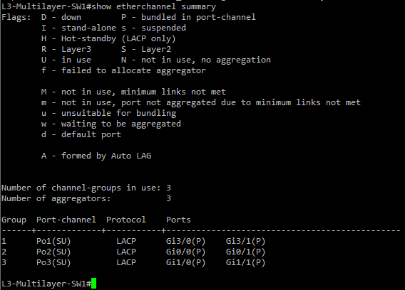

You can also use:
```
show interfaces port-channel [port channel number] trunk
```
The output should show:
- Mode is on
- Native VLAN is 666
- Allowed VLANs are correct for that bundle
- the status is trunking

L3-Multilayer-SW1 show interfaces port-channel 1 trunk:

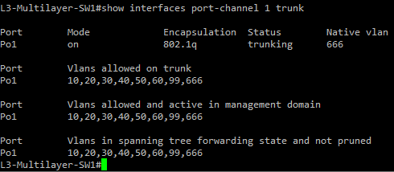

### Common Problems

| Problem | Fix |
|---------|-----|
| Port-channel not forming | Verify both sides have matching channel-group numbers and at least one side is active. Run "show etherchannel summary" to check flags |
| LACP bundle not negotiating | Both sides may be set to passive. At least one side must be active. Change one of the sides to active. |
| Port showing D flag | Port is down. Run "no shutdown" on the affected port |

## Configuring Spanning Tree

Rapid PVST+ runs a separate spanning tree instance per VLAN. The root bridge is set by configuring a lower STP priority on the switch that should be the root for each VLAN. A lower priority wins the root bridge election. The default STP priority on Cisco switches is 32768 so setting the core switches to 4096 for primary and 8192 for secondary, they will always win the root bridge election.

The STP root bridge assignments match the HSRP active gateway assignments for each VLAN group. This ensures traffic from access switches always flows up to the correct core switch. STP will block the standby links on the access switches for the non primary VLANs. If a core switch goes down, Rapid PVST+ will quickly unblock the standby link so that traffic can reach the other switch.

### Enabling Rapid PVST+

Rapid PVST+ must be enabled on all five switches before setting root bridge priorites.

```
enable
configure terminal
spanning-tree mode rapid-pvst
end
do write

show spanning-tree summary
```
In show spanning-tree summary, the first line should say switch is in rapid-pvst mode.

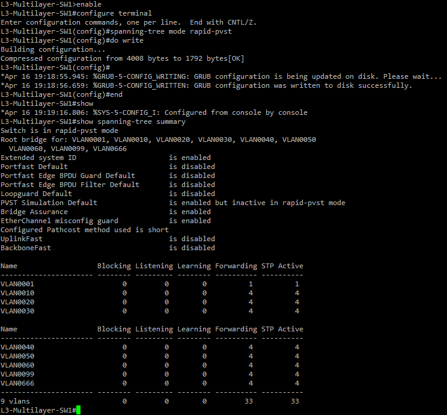

*Configure Rapid PVST for all five switches.*

### Setting Root Bridge Priorities

The root bridge priorities only need to be configured on the core switches because the access switches will use the default of 32768.

| Switch | Primary Root VLANs | Secondary Root VLANs |
|--------|--------------------|----------------------|
| L3-Multilayer-SW1 | 10,20,30,99 | 40,50,60 |
| L3-Multilayer-SW2 | 40,50,60 | 10,20,30,99 |

**L3-Multilayer-SW1:**
```
enable
configure terminal
spanning-tree vlan 10,20,30,99 priority 4096
spanning-tree vlan 40,50,60 priority 8192
exit
write
```

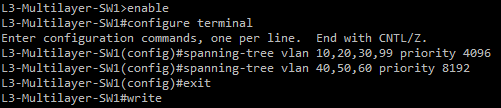

**L3-Multilayer-SW2:**
```
enable
configure terminal
spanning-tree vlan 40,50,60 priority 4096
spanning-tree vlan 10,20,30,99 priority 8192
exit
write
```

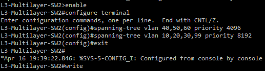

**Verify Root Bridge**

To verify the root bridges are confirmed, run:
```
show spanning-tree summary
```
L3-Multilayer-SW1 should show the root bridge for 1,10,20,30,99,666:

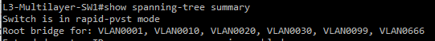

L3-Multilayer-SW2 should show the root bridge for 1,40,50,60:

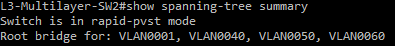

You can also verify the correct root bridge, correct priority values, and correct ports are forwarding and blocking for each vlan using:

```
show spanning-tree
```

Example L3-Multilayer-SW1:

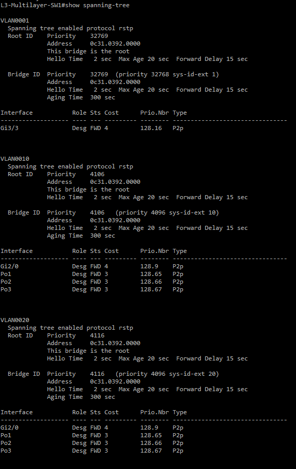
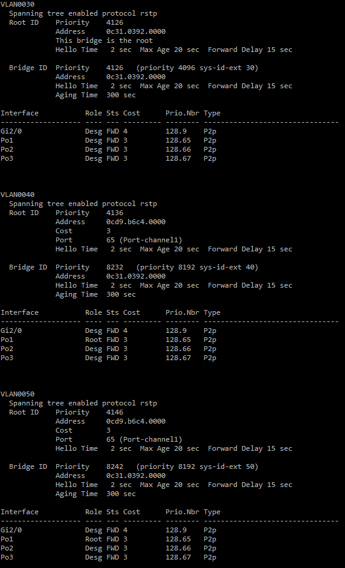

### Configure PortFast and BPDU Guard

PortFast improves the connection speed by skipping the STP listening and learning states so end devices get access to the network immediately. BPDU Guard protects PortFast enabled ports by shutting down the port and placing it into an err-disabled state if an unexpected BPDU is received. This prevents someone from plugging a switch into a port and disrupting STP.

**Do not configure PortFast or BPDU Guard on trunk ports or EtherChannel ports. Only configure them on access ports facing end devices.**

Configure PortFast and BPDU Guard on each access port on L2-SW1, L2-SW2, and L2-SW3. The example will only show the configuration of L2-SW1.

**L2-SW1:**
```
enable
configure terminal
interface Gi3/0 
spanning-tree portfast
spanning-tree bpduguard enable
exit

interface Gi3/2
spanning-tree portfast
spanning-tree bpduguard enable
exit
do write
```

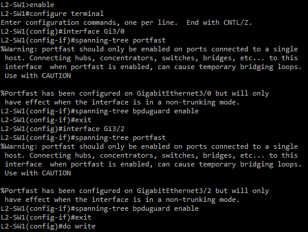

**Verify PortFast and BPDU Guard**

On each access switch, run:
```
show running-config
```
Under each access port interface, it should show spanning-tree portfast edge and spanning-tree bpduguard enable. The example output is for L2-SW1.

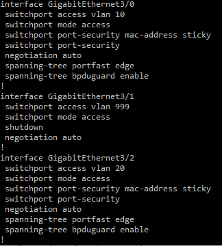

