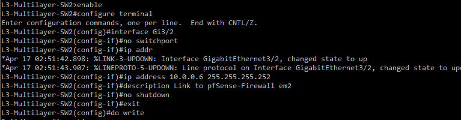
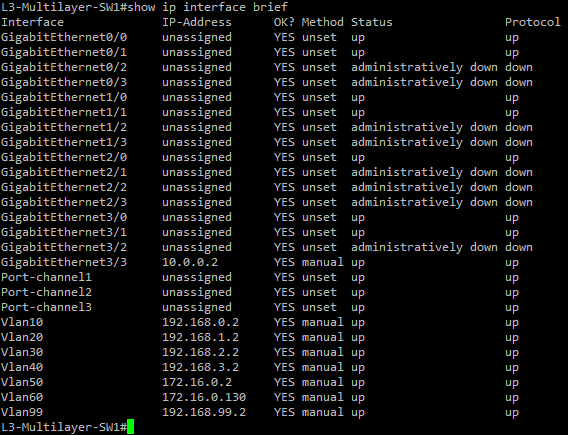
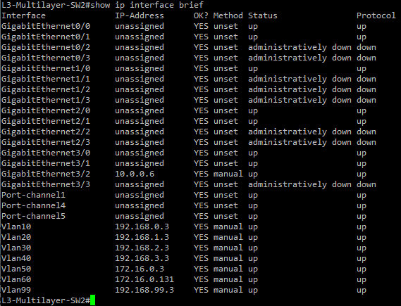
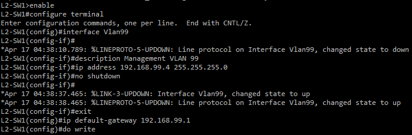

# Inter-VLAN Routing and OSPF

This section covers the layer 3 configuration in the network and how communication is provided between VLANs and devices in the network. This includes enabling IP routing on the core switches to let them operate as layer 3 devices, setting interfaces for the uplinks to the pfSense firewall, configuring SVIs for each VLAN, configuring management SVIs, and configuring OSPF for routing across the network. Basic connectivity between devices will be verified in this section.

<br>

## Enable IP Routing

IP routing must be enabled on both layer 3 core switches to allow them to operate at layer 3 and route traffic between VLANs.

Apply this to both L3-Multilayer-SW1 and L3-Multilayer-SW2:
```
enable
configure terminal
ip routing
exit
write
```

<br>

## Configuring Interfaces for pfSense Uplinks

Before setting IP addresses on the interfaces, you must first use the 'no switchport' command on the interface to turn the layer 2 switchports into layer 3 routed interfaces, even after using the 'ip routing' command.
After that you can assign them the IP addresses from the point-to-point section in 02-ip-addressing-subnetting-and-vlans.

### L3-Multilayer-SW1 Gi3/3

```
enable
configure terminal
interface Gi3/3
no switchport
ip address 10.0.0.2 255.255.255.252
description Link to pfSense-Firewall em3
no shutdown
exit
do write
```


### L3-Multilayer-SW2 Gi3/2

```
enable
configure terminal
interface Gi3/2
no switchport
ip address 10.0.0.6 255.255.255.252
description Link to pfSense-Firewall em2
no shutdown
exit
do write
```



### Verify

To confirm this worked, run:
```
show ip interface brief
```
And confirm that the correct interface shows the correct ip address. Also confirm that the status and protocol both show 'up'.

<br>

## Configuring SVIs on Layer 3 Switches

The Switched Virtual Interfaces (SVIs) are the layer 3 gateway interfaces for each VLAN. Each SVI will be assigned the switch's IP address for each VLAN. Use the address table from Section 02 for the ip address.

Before you configure the SVIs power on each end device/server. This ensures the SVIs come up when you verify.

### L3-Multilayer-SW1 SVIs

```
enable
configure terminal
interface Vlan10
description HR Department VLAN 10 Gateway
ip address 192.168.0.2 255.255.255.0
no shutdown
exit

interface Vlan20
description Sales Department VLAN 20 Gateway
ip address 192.168.1.2 255.255.255.0
no shutdown
exit

interface Vlan30
description Finance Department VLAN 30 Gateway
ip address 192.168.2.2 255.255.255.0
no shutdown
exit

interface Vlan40
description IT Department VLAN 40 Gateway
ip address 192.168.3.2 255.255.255.0
no shutdown
exit

interface Vlan50
description Infrastructure Server VLAN 50 Gateway
ip address 172.16.0.2 255.255.255.128
no shutdown
exit

interface Vlan60
description Monitoring Server VLAN 60 Gateway
ip address 172.16.0.130 255.255.255.128
no shutdown
exit

interface Vlan99
description Management VLAN 99 Gateway
ip address 192.168.99.2 255.255.255.0
no shutdown
exit
do write
```

### L3-Multilayer-SW2 SVIs
```
enable
configure terminal
interface Vlan10
description HR Department VLAN 10 Gateway
ip address 192.168.0.3 255.255.255.0
no shutdown
exit

interface Vlan20
description Sales Department VLAN 20 Gateway
ip address 192.168.1.3 255.255.255.0
no shutdown
exit

interface Vlan30
description Finance Department VLAN 30 Gateway
ip address 192.168.2.3 255.255.255.0
no shutdown
exit

interface Vlan40
description IT Department VLAN 40 Gateway
ip address 192.168.3.3 255.255.255.0
no shutdown
exit

interface Vlan50
description Infrastructure Server VLAN 50 Gateway
ip address 172.16.0.3 255.255.255.128
no shutdown
exit

interface Vlan60
description Monitoring Server VLAN 60 Gateway
ip address 172.16.0.131 255.255.255.128
no shutdown
exit

interface Vlan99
description Management VLAN 99 Gateway
ip address 192.168.99.3 255.255.255.0
no shutdown
exit
do write
```

### Verify SVIs

To verify the SVIs were sucessfully created and assigned an IP address, use:
```
show ip interface brief
```

The SVI interface should show the correct IP address and a status and protocol of 'up'. If any interface shows 'down' verify the vlan exists and the end devices/servers are powered on.

**L3-Multilayer-SW1 Verification:**



**L3-Multilayer-SW2 Verification:**



<br>

## Configuring Management SVIs on Layer 2 Switches

The layer 2 switches will need a VLAN 99 SVI for SSH access to manage the devices. The default gateway will point to the HSRP virtual IP for VLAN 99 to allow management traffic to be routed.

### L2-SW1
```
enable
configure terminal
interface Vlan99
description Management VLAN 99
ip address 192.168.99.4 255.255.255.0
no shutdown
exit
ip default-gateway 192.168.99.1
do write
```



