# Inter-VLAN Routing and OSPF

This section covers the layer 3 configuration in the network and how communication is provided between VLANs and devices in the network. This includes enabling IP routing on the core switches to let them operate as layer 3 devices, setting interfaces for the uplinks to the pfSense firewall, configuring SVIs for each VLAN, configuring management SVIs, and configuring OSPF for routing across the network. Basic connectivity between devices will be verified in this section. The end will list common problems when configuring this section.

<br>

## Enable IP Routing

IP routing must be enabled on both layer 3 core switches to allow them to operate at layer 3 and route traffic between VLANs.

Apply this to both L3-Multilayer-SW1 and L3-Multilayer-SW2:
```
enable
configure terminal

ip routing
exit
write
```

<br>

## Configuring Interfaces for pfSense Uplinks

Before setting IP addresses on the interfaces, you must first use the 'no switchport' command on the interface to turn the layer 2 switchports into layer 3 routed interfaces, even after using the 'ip routing' command.
After that you can assign them the IP addresses from the point-to-point section in 02-ip-addressing-subnetting-and-vlans.

### L3-Multilayer-SW1 Gi3/3

```
enable
configure terminal

interface Gi3/3
no switchport
ip address 10.0.0.2 255.255.255.252
description Link to pfSense-Firewall em3
no shutdown
exit
do write
```


### L3-Multilayer-SW2 Gi3/2

```
enable
configure terminal

interface Gi3/2
no switchport
ip address 10.0.0.6 255.255.255.252
description Link to pfSense-Firewall em2
no shutdown
exit
do write
```


### Verify

To confirm this worked, run:
```
show ip interface brief
```
And confirm that the correct interface shows the correct ip address. Also confirm that the status and protocol both show 'up'.

<br>

## Configuring SVIs on Layer 3 Switches

The Switched Virtual Interfaces (SVIs) are the layer 3 gateway interfaces for each VLAN. Each SVI will be assigned the switch's IP address for each VLAN. Use the address table from Section 02 for the ip address.

Before you configure the SVIs power on each end device/server. This ensures the SVIs come up when you verify.

### L3-Multilayer-SW1 SVIs

```
enable
configure terminal

interface Vlan10
description HR Department VLAN 10 Gateway
ip address 192.168.0.2 255.255.255.0
no shutdown
exit

interface Vlan20
description Sales Department VLAN 20 Gateway
ip address 192.168.1.2 255.255.255.0
no shutdown
exit

interface Vlan30
description Finance Department VLAN 30 Gateway
ip address 192.168.2.2 255.255.255.0
no shutdown
exit

interface Vlan40
description IT Department VLAN 40 Gateway
ip address 192.168.3.2 255.255.255.0
no shutdown
exit

interface Vlan50
description Infrastructure Server VLAN 50 Gateway
ip address 172.16.0.2 255.255.255.128
no shutdown
exit

interface Vlan60
description Monitoring Server VLAN 60 Gateway
ip address 172.16.0.130 255.255.255.128
no shutdown
exit

interface Vlan99
description Management VLAN 99 Gateway
ip address 192.168.99.2 255.255.255.0
no shutdown
exit
do write
```

### L3-Multilayer-SW2 SVIs
```
enable
configure terminal

interface Vlan10
description HR Department VLAN 10 Gateway
ip address 192.168.0.3 255.255.255.0
no shutdown
exit

interface Vlan20
description Sales Department VLAN 20 Gateway
ip address 192.168.1.3 255.255.255.0
no shutdown
exit

interface Vlan30
description Finance Department VLAN 30 Gateway
ip address 192.168.2.3 255.255.255.0
no shutdown
exit

interface Vlan40
description IT Department VLAN 40 Gateway
ip address 192.168.3.3 255.255.255.0
no shutdown
exit

interface Vlan50
description Infrastructure Server VLAN 50 Gateway
ip address 172.16.0.3 255.255.255.128
no shutdown
exit

interface Vlan60
description Monitoring Server VLAN 60 Gateway
ip address 172.16.0.131 255.255.255.128
no shutdown
exit

interface Vlan99
description Management VLAN 99 Gateway
ip address 192.168.99.3 255.255.255.0
no shutdown
exit
do write
```

### Verify SVIs

To verify the SVIs were successfully created and assigned an IP address, use:
```
show ip interface brief
```

The SVI interface should show the correct IP address and a status and protocol of 'up'. If any interface shows 'down' verify the vlan exists and the end devices/servers are powered on.

**L3-Multilayer-SW1 Verification:**


**L3-Multilayer-SW2 Verification:**


<br>

## Configuring Management SVIs on Layer 2 Switches

The layer 2 switches will need a VLAN 99 SVI for SSH access to manage the devices. The default gateway will point to the HSRP virtual IP for VLAN 99 to allow management traffic to be routed.

### L2-SW1
```
enable
configure terminal

interface Vlan99
description Management VLAN 99
ip address 192.168.99.4 255.255.255.0
no shutdown
exit
ip default-gateway 192.168.99.1
do write
```


### L2-SW2
```
enable
configure terminal

interface Vlan99
description Management VLAN 99
ip address 192.168.99.5 255.255.255.0
no shutdown
exit
ip default-gateway 192.168.99.1
do write
```
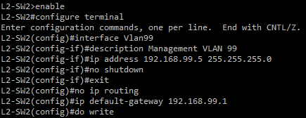

### L2-SW3
```
enable
configure terminal

interface Vlan99
description Management VLAN 99
ip address 192.168.99.6 255.255.255.0
no shutdown
exit
ip default-gateway 192.168.99.1
do write
```
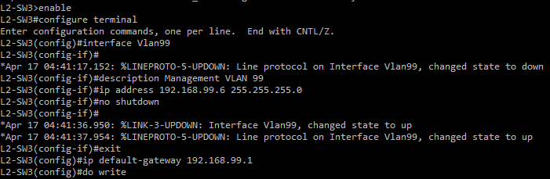

### Verify Management SVIs

To verify management SVI creation on each switch, use:
```
show ip interface brief
```
and
```
show running-config
```
- Vlan99 should show the status and protocol 'up'.
- Interface Vlan99 should show the correct IP and default gateway.

<br>

## Configuring OSPF on Layer 3 Switches

OSPF is configured on both Layer 3 switches to provide dynamic routing across the network. OSPF is configured with the network addresses of each subnet the switch is directly connected to. This tells OSPF which interfaces to activate on and which networks to advertise to neighboring routers. Since this is a single site network we will keep these in the same area (area 0). We will manually configure a router ID so that OSPF always uses a stable identifier in case of an interface failure. We will also set the network type to point-to-point on the pfSense uplinks to prevent Designated Router/Backup Designated Router election. Since there are only two devices there is no need for a DR/BDR. Additionally, we will configure passive interfaces on the department VLANs to prevent hello messages from being sent toward those devices.

The peer link between L3-Multilayer-SW1 and L3-Multilayer-SW2 is a layer 2 EtherChannel trunk and OSPF cannot run on layer 2 so the adjacency will form over the VLAN 99 SVI. This means no network statement is needed for the peer link. This is also why Vlan99 is not in the passive-interface list.

**Note:** OSPF uses wildcard masks instead of subnet masks in its configuration. The wildcard mask is the inverse of the subnet mask. The subnet masks we are using and their matching wildcard mask is listed below.

| Subnet Mask | Wildcard Mask |
|-------------|---------------|
| 255.255.255.0 | 0.0.0.255 |
| 255.255.255.128 | 0.0.0.127 |
| 255.255.255.252 | 0.0.0.3 |

### L3-Multilayer-SW1
```
enable
configure terminal

router ospf 1
router-id 1.1.1.1
network 10.0.0.0 0.0.0.3 area 0
network 192.168.0.0 0.0.0.255 area 0
network 192.168.1.0 0.0.0.255 area 0
network 192.168.2.0 0.0.0.255 area 0
network 192.168.3.0 0.0.0.255 area 0
network 172.16.0.0 0.0.0.127 area 0
network 172.16.0.128 0.0.0.127 area 0
network 192.168.99.0 0.0.0.255 area 0
passive-interface Vlan10
passive-interface Vlan20
passive-interface Vlan30
passive-interface Vlan40
passive-interface Vlan50
passive-interface Vlan60
exit

interface Gi3/3
ip ospf network point-to-point
exit
do write
```
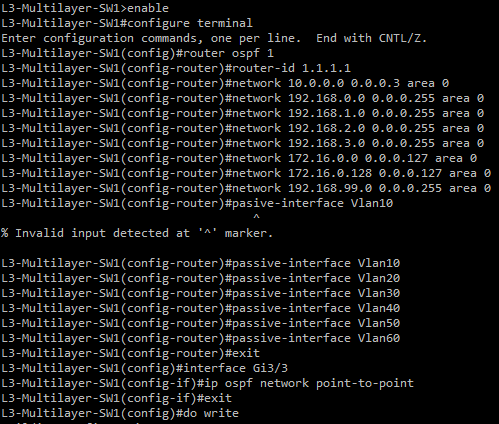

### L3-Multilayer-SW2
```
enable
configure terminal

router ospf 1
router-id 2.2.2.2
network 10.0.0.4 0.0.0.3 area 0
network 192.168.0.0 0.0.0.255 area 0
network 192.168.1.0 0.0.0.255 area 0
network 192.168.2.0 0.0.0.255 area 0
network 192.168.3.0 0.0.0.255 area 0
network 172.16.0.0 0.0.0.127 area 0
network 172.16.0.128 0.0.0.127 area 0
network 192.168.99.0 0.0.0.255 area 0
passive-interface Vlan10
passive-interface Vlan20
passive-interface Vlan30
passive-interface Vlan40
passive-interface Vlan50
passive-interface Vlan60
exit

interface Gi3/2
ip ospf network point-to-point
exit
do write
```
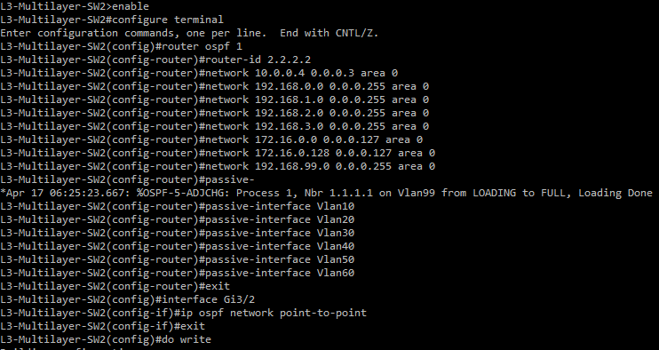

### Verify OSPF Configuration

- To verify the process ID, area, IP address, and neighbor, run:
```
show ip ospf interface brief
```
**Note:** VLAN 99 should show 1 neighbor on each switch.

<br>

- To verify the ospf route has been learned by the other switch, run:
```
show ip route ospf
```
**Note:** For now, each switch should only have one route learned, which is the point-to-point network on the other switch. Additional routes will show when pfSense forms adjacency with the switches in Section 08.

<br>

- To verify the correct neighbor ID and that it is forming adjacency between the core switches over VLAN 99, run:
```
show ip ospf neighbor
```

**L3-Multilayer-SW1 Verification:**

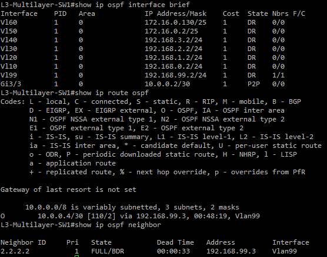

**L3-Multilayer-SW2 Verification:**

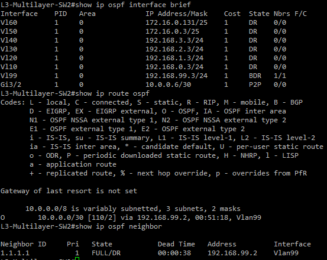

Before we move on to ping tests, you can also verify that each connected network appears in the routing table and is correct by running:
```
show ip route connected
```
Both Layer 3 switches have SVIs configured for every VLAN because both switches need an IP address on each VLAN to act as the active and standby HSRP gateways. You should see a C entry for each directly connected subnet and an L entry for the switch's own IP address on that interface. This includes all department VLANs, server VLANs, the management VLAN, and the point-to-point link to pfSense.

**L3-Multilayer-SW1 Connected Networks:**

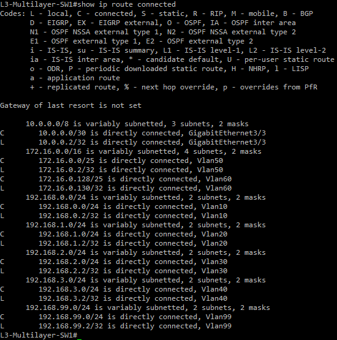

**L3-Multilayer-SW2 Connected Networks:**

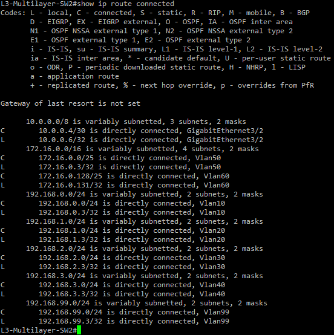

<br>

## Ping Testing Verification

We will verify connectivity between devices using ping tests. For most of these pings it is expected for the first ping to drop due to ARP resolution.

<br>

### L3-Multilayer-SW1
---

<br>

**Ping L3-Multilayer-SW2 VLAN 99 SVI:**
```
ping 192.168.99.3
```
A successful ping confirms the OSPF adjacency across the peer link through VLAN 99.

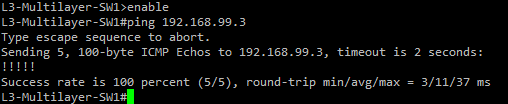

**Ping L3-Multilayer-SW2 VLAN 10 SVI:**
```
ping 192.168.0.3
```
A successful ping confirms department VLAN routing.

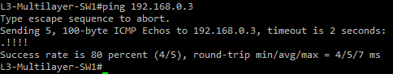

**Ping L3-Multilayer-SW2 VLAN 50 SVI:**
```
ping 172.16.0.3
```
A successful ping confirms server VLAN routing.

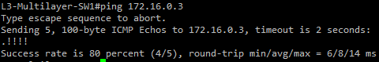

**Ping L2-SW1, L2-SW2, L2-SW3 VLAN 99:**
```
ping 192.168.99.4
ping 192.168.99.5
ping 192.168.99.6
```
A successful ping will confirm management interfaces are up and VLAN 99 traffic is forwarding correctly across all trunk links.

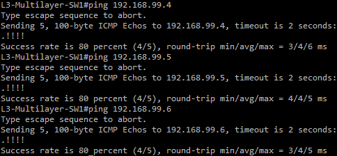

### L3-Multilayer-SW2
---

**Ping L3-Multilayer-SW1 SVIs:**
```
ping 192.168.99.2
ping 192.168.1.2
ping 192.168.2.2
ping 192.168.3.2
ping 172.16.0.2
ping 172.16.0.130
```
A successful ping on each will confirm all VLAN SVIs are reachable on L3-Multilayer-SW1.

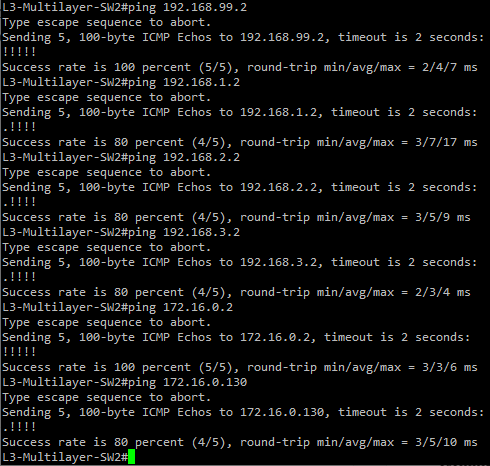

<br>

## Common Problems

| Problem | Fix |
|---------|-----|
| ip routing command not available | IOSvL2 might have it enabled already. Verify a routing table exists with 'show ip route'. If it does not exist try rerunning 'ip routing'. |
| Ping between layer 3 switches failing | Run 'show ip interface brief' and bring up any down SVI using 'no shutdown'. Run 'show interfaces trunk' and confirm the correct VLANs are allowed on Po1. If any are missing add it using 'switchport trunk allowed vlan add [id]' on the Po1 interface. |
| OSPF neighbors not forming | Verify VLAN 99 SVIs are up on both switches using 'show ip interface brief'. If they are down bring them up using 'no shutdown' on the Vlan99 interface. If the SVI is up but neighbors do not form verify the VLAN 99 network statement exists in 'show running-config' on both switches. If one is missing add it with 'router ospf 1' then 'network 192.168.99.0 0.0.0.255 area 0' on the affected switch. |
| Routed interface showing as switchport | The 'no switchport' command was not applied. Rerun the command on the affected interface. |
| Ping from L3 switch to L2 switch management SVI failing | Verify the VLAN 99 SVI is up on the L2 switch with 'show ip interface brief'. If it is down run 'no shutdown' on the Vlan99 interface. Verify the IP address is correct and update it if not by running 'interface Vlan99' and then 'ip address [correct ip] [subnet mask]'. |
| Ping succeeds from L3-Multilayer-SW1 to L3-Multilayer-SW2 but not the reverse | Verify the SVI IP address is correct on L3-Multilayer-SW2 with 'show ip interface brief'. If an IP address is wrong use 'interface Vlan[id]' to go into the affected interface and rerun 'ip address [correct ip] [subnet mask]'. |
