# HSRP Configuration

HSRP (Hot Standby Router Protocol) is a protocol that provides redundancy for the network by creating a virtual IP address that is shared between the two core switches with one acting as the active and the other as the standby. If the active core switch goes down the standby takes over as the gateway. The end devices use the virtual IP as their default gateway so no changes will be needed on devices if one core switch goes down. HSRP will switch the virtual IP address automatically. In this topology, we will be dedicating one of the core switches to be active for VLANs 10, 20, 30, and 99, and the other switch active for VLANs 40, 50, and 60, to align with the STP root bridge assignments from section 05. This ensures that both switches are handling traffic rather than one sitting idle as a backup.

In this section we will cover the configuration of HSRP, verification of HSRP, ping tests, and failover tests to confirm connectivity.

<br>

## HSRP Active Assignments

| VLAN | Virtual IP | Active Switch | Standby Switch |
|------|------------|---------------|----------------|
| 10 | 192.168.0.1 | L3-Multilayer-SW1 | L3-Multilayer-SW2 |
| 20 | 192.168.1.1 | L3-Multilayer-SW1 | L3-Multilayer-SW2 |
| 30 | 192.168.2.1 | L3-Multilayer-SW1 | L3-Multilayer-SW2 |
| 40 | 192.168.3.1 | L3-Multilayer-SW2 | L3-Multilayer-SW1 |
| 50 | 172.16.0.1 | L3-Multilayer-SW2 | L3-Multilayer-SW1 |
| 60 | 172.16.0.129 | L3-Multilayer-SW2 | L3-Multilayer-SW1 |
| 99 | 192.168.99.1 | L3-Multilayer-SW1 | L3-Multilayer-SW2 |


### Active Switch Priority

HSRP uses a higher priority to win the role of active switch, so the active switch for a VLAN will be configured with priority 110 and it will always win the election. The standby switch will keep the default priority of 100 so it only wins after the active switch goes down. We will be enabling preemption on the active switch so it will automatically recover the active role after the switch comes back up. Preemption is only configured on the switch that is active for that VLAN.

<br>

## Configuring HSRP

To keep the configuration easy to read, the HSRP group number for each VLAN will match the VLAN ID.

### L3-Multilayer-SW1

L3-Multilayer-SW1 is the active switch for VLANs 10, 20, 30, and 99 with priority 110 and preemption enabled. It is the standby switch for VLANs 40, 50, and 60 so those VLANs will have the default priority 100 and no preemption.

```
enable
configure terminal

interface Vlan10
standby version 2
standby 10 ip 192.168.0.1
standby 10 priority 110
standby 10 preempt
exit

interface Vlan20
standby version 2
standby 20 ip 192.168.1.1
standby 20 priority 110
standby 20 preempt
exit

interface Vlan30
standby version 2
standby 30 ip 192.168.2.1
standby 30 priority 110
standby 30 preempt
exit

interface Vlan40
standby version 2
standby 40 ip 192.168.3.1
exit

interface Vlan50
standby version 2
standby 50 ip 172.16.0.1
exit

interface Vlan60
standby version 2
standby 60 ip 172.16.0.129
exit

interface Vlan99
standby version 2
standby 99 ip 192.168.99.1
standby 99 priority 110
standby 99 preempt
exit
do write
```
**Note:** Before HSRP is configured on L3-Multilayer-SW2, the VLANs that are supposed to be standby will show as active. This is okay and it is because there is no other HSRP devices to take priority. It will change once HSRP is configured on L3-Multilayer-SW2.

**The example will only show HSRP configuration of Vlan30 and Vlan40.**

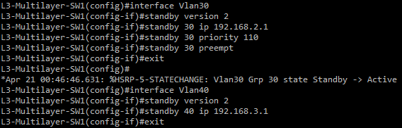

### L3-Multilayer-SW2

L3-Multilayer-SW2 is the active switch for VLANs 40, 50, and 60 with priority 110 and preemption enabled. It is the standby switch for VLANs 10, 20, 30 and 99 so those VLANs will have the default priority 100 and no preemption.

```
enable
configure terminal

interface Vlan10
standby version 2
standby 10 ip 192.168.0.1
exit

interface Vlan20
standby version 2
standby 20 ip 192.168.1.1
exit

interface Vlan30
standby version 2
standby 30 ip 192.168.2.1
exit

interface Vlan40
standby version 2
standby 40 ip 192.168.3.1
standby 40 priority 110
standby 40 preempt
exit

interface Vlan50
standby version 2
standby 50 ip 172.16.0.1
standby 50 priority 110
standby 50 preempt
exit

interface Vlan60
standby version 2
standby 60 ip 172.16.0.129
standby 60 priority 110
standby 60 preempt
exit

interface Vlan99
standby version 2
standby 99 ip 192.168.99.1
exit
do write
```

**The example will only show HSRP configuration of Vlan30 and Vlan40.**

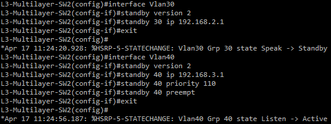

<br>

## Verify HSRP

To verify the group number, priority, active/standby state, active/standby addresses, and the virtual IP, run:
```
show standby brief
```

### L3-Multilayer-SW1 Verification

L3-Multilayer-SW1 should show:

- Priority 110 and state Active for VLANs 10,20,30,99
- Priority 100 and state Standby for VLANs 40,50,60
- Correct virtual IP matching the table
- Active/Standby addresses of L3-Multilayer-SW2

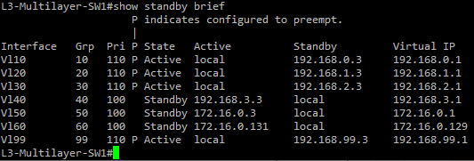

### L3-Multilayer-SW2 Verification

L3-Multilayer-SW2 should show:

- Priority 110 and state Active for VLANs 40,50,60
- Priority 100 and state Standby for VLANs 10,20,30,99
- Correct virtual IP matching the table
- Active/Standby addresses of L3-Multilayer-SW1

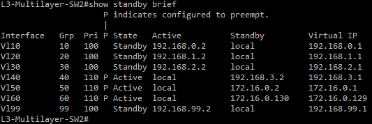

<br>

## Ping Testing Verification

The VPCS workstations will need to be configured with an IP address and a default gateway for ping testing now that the end devices can use the HSRP virtual IP for their VLAN as their default gateway. They will eventually use DHCP in a later section, but for now we need to statically assign addresses for testing.

### Configure VPCS IPs

**PC1-HR (VLAN 10):**
```
ip 192.168.0.10 255.255.255.0 192.168.0.1
```

**PC2-Sales (VLAN 20):**
```
ip 192.168.1.10 255.255.255.0 192.168.1.1
```

**PC3-Finance (VLAN 30):**
```
ip 192.168.2.10 255.255.255.0 192.168.2.1
```

**PC4-IT (VLAN 40):**
```
ip 192.168.3.10 255.255.255.0 192.168.3.1
```

### Ping Tests

**PC1-HR ping own default gateway:**
```
ping 192.168.0.1
```
A successful ping shows PC1-HR can reach the HSRP VLAN 10 virtual IP.

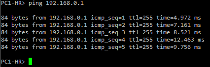

**PC1-HR ping L3-Multilayer-SW2 VLAN 10 SVI:**
```
ping 192.168.0.3
```
A successful ping shows that inter-VLAN routing is working from end devices.

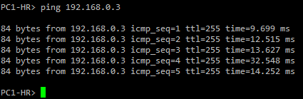

**PC2-Sales ping PC3-Finance:**
```
ping 192.168.2.10
```
A successful ping shows connectivity between department devices in different VLANs.

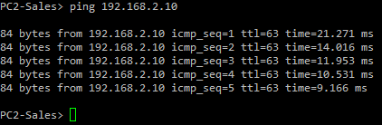

**PC4-IT ping own default gateway:**
```
ping 192.168.3.1
```
A successful ping shows PC4-IT can reach the HSRP VLAN 40 virtual IP active on L3-Multilayer-SW2.


## HSRP Failover Test

This confirms that HSRP fails over to the standby switch when the active switch goes down.

### Step 1

**Verify the current active switch for VLAN 10**

On L3-Multilayer-SW1, run:
```
show standby brief
```
L3-Multilayer-SW1 should show as active for VLAN 10.

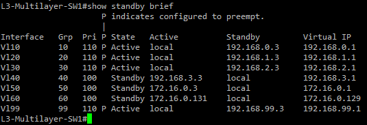

### Step 2

**Ping from PC1-HR to its own default gateway to confirm connectivity**
```
ping 192.168.0.1
```

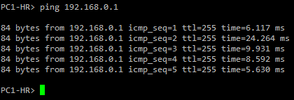

### Step 3

**Turn off L3-Multilayer-SW1 in GNS3**
```
left click L3-Multilayer-SW1
click Stop
```

### Step 4

**Verify failover on L3-Multilayer-SW2**

On L3-Multilayer-SW2, run:
```
show standby brief
```
L3-Multilayer-SW2 should now show active for all VLANs.

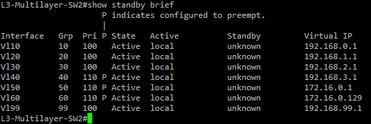

### Step 5

**Ping from PC1-HR to its own default gateway to confirm connectivity after failover**
```
ping 192.168.0.1
```
Ping should be successful even with L3-Multilayer-SW1 down.

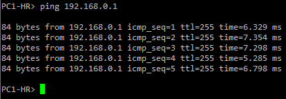

### Step 6

**Restart L3-Multilayer-SW1 in GNS3**
```
left click L3-Multilayer-SW1
click Start
```
Wait for the device to fully boot.

### Step 7

**Confirm L3-Multilayer-SW1 is active again**

On L3-Multilayer-SW1, run:
```
show standby brief
```
L3-Multilayer-SW1 should show active for VLANs 10, 20, 30, and 99 again.

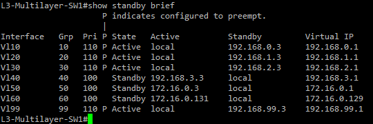

### Step 8

**Ping from PC1-HR to its own default gateway after L3-Multilayer-SW1 is active again**

```
ping 192.168.0.1
```
Pings should be successful

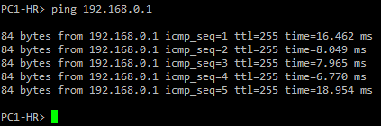

<br>

## Common Problems

