# pfSense Configuration

In this network, pfSense will act as the edge firewall and default gateway for internet traffic. It connects to both layer 3 core switches via point-to-point links and will run OSPF to advertise a default route into the network so devices can reach the internet.
This section will include an addition to the topology. It will cover the set up of a cloud node for browser access to pfSense, configuring pfSense interfaces, installing the FRR package for OSPF, configuring OSPF on pfSense, configuring NAT settings, verifying OSPF adjacency, and verifying internet access from end devices.

pfSense firewall rules will be configured in a later section after all internal services are configured. This ensures these services can be configured and verified without firewall rules potentially blocking the traffic from these services.

<br>


## Setting up a Cloud Node for webConfigurator Access

The GNS3 cloud node will allow your host machine to directly access the GNS3 network to allow you to access the pfSense webConfigurator from a browser on your host machine.

### Step 1: Check Your Host Machines VMware adapter IP Address

The pfSense interface connecting to the cloud node needs to be configured on the same subnet as the host machines VMware adapter. First we need to see what subnet that adapter is on.

On your host machine open the Command Prompt and run:
```
ipconfig
```
Look for the IP address that is on **VMware Network Adapter VMnet8**. Note this IPv4 address down. The interface to the cloud node (we will be using em1) must be configured with an IP address on this same subnet. **Example: My VMware Network Adapter VMnet8 shows an IPv4 address of 192.168.245.1. This means the em1 interface to the cloud node must be configured with an IP address of 192.168.245.2.**

### Step 2: Add a Cloud Node to the GNS3 Topology

In GNS3:

- Drag a Cloud Node above the pfSense-Firewall
- Choose the GNS3 VM server
- Right click the cloud node and click configure
- Select eth1 from the available interfaces and click Add then OK
- Connect a cable from the **eth1** interface of the Cloud Node to the **em1** interface of the pfSense-Firewall

The new topology should look like this:

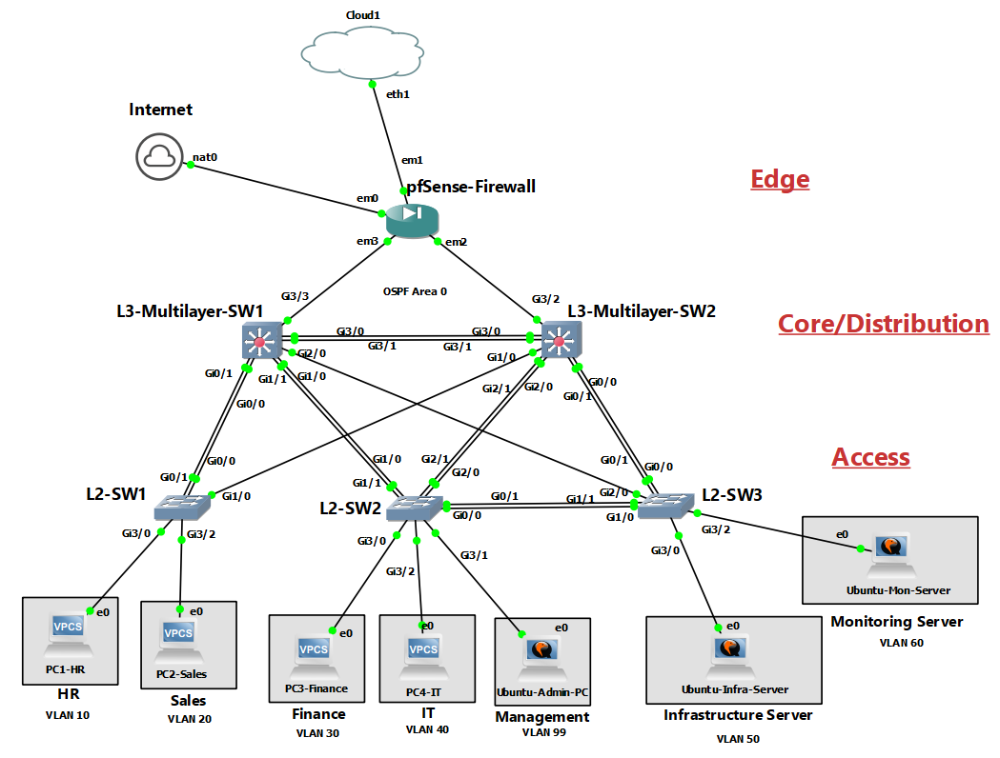

### Step 3: Assign pfSense Interfaces in the pfSense Console Menu

After loading up pfSense, select option 1: Assign Interfaces
```
Should VLANs be set up now?: n
Enter WAN interface name: em0
Enter LAN interface name: em1
Enter optional interface 1: em2
Enter optional interface 2: em3
Enter optional interface 3: (skip by pressing enter)
Do you want to proceed?: y
```

### Step 4: Set WAN and LAN IP addresses in the pfSense Console Menu

**WAN interface (em0) connecting to NAT node:**

From the console menu, select Option 2: Set interface(s) IP address
```
Enter the number of the interface you wish to configure: 1 
Configure IPv4 address WAN interface via DHCP?: y
Configure IPv6 address WAN interface via DHCP6?: n
Enter the new WAN IPv6 address: (press enter for none)
```
The WAN interface will now have an IP address recieved from DHCP via the NAT node

**LAN interface (em1) connecting to Cloud node:**

From the console menu, select option 2: Set interface(s) IP address

!!!**THE IP ADDRESS CONFIGURED SHOULD BE ON THE SAME SUBNET AS THE ADDRESS FOUND IN STEP 1**!!!
```
Enter the number of the interface you wish to configure: 2
Configure IPv4 address LAN interface via DHCP?: n
Enter the new LAN IPv4 address: 192.168.245.2
Enter the new LAN IPv4 subnet bit count: 24
Enter the new LAN IPv4 upstream gateway address: (press enter for none)
Configure IPv6 address LAN interface via DHCP6?: n
Enter the new LAN IPv6 address: (press enter for none)
Do you want to enable the DHCP server on LAN?: n
```

<br>

You can now open a browser on your host machine and enter the em1 IPv4 address to open the pfSense webConfigurator. It is displayed in the main console menu on pfSense.

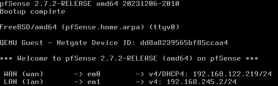

<br>

## Configure OPT1 (em2) and OPT2 (em3) Interfaces in the webConfigurator

On your host machine, open a browser and enter the em1 IP address you configured.
```
http://192.168.245.2
```
Log in to pfSense with these default credentials:

- Username: admin
- Password: pfSense

**Note:** In a production environment the username and password should be changed to something secure but for lab purposes you can leave it at default if you would like.

### Assign OPT1 (em2) and OPT2 (em3) Interfaces

- Go to Interfaces → Assignments
- em2 and em3 should appear next to available network ports
- Click Add next to em2 and it should become OPT1
- Click Add next to em3 and it should become OPT2
- Click Save

### Configure OPT1 (em2)

This is the link connecting to L3-Multilayer-SW2. Configure it with the point-to-point IP address for em2 chosen in section 02.

- Go to Interfaces → OPT1
- Check Enable Interface
- Set the description to L3-Multilayer-SW2-Link
- Set IPv4 Configuration Type to Static IPv4
- Set IPv4 Address to 10.0.0.5 with subnet /30
- Leave IPv4 Upstream Gateway blank
- Click Save then Apply Changes

### Configure OPT2 (em3)

This is the link connecting to L3-Multilayer-SW1. Configure it with the point-to-point IP address for em3 chosen in section 02.

- Go to Interfaces → OPT2
- Check Enable Interface
- Set Description to L3-Multilayer-SW1-Link
- Set IPv4 Configuration Type to Static IPv4
- Set IPv4 Address to 10.0.0.1 with subnet /30
- Leave IPv4 Upstream Gateway blank
- Click Save then Apply Changes

### Verify Interfaces

- Go to Status → Dashboard
- All 4 interfaces should show up and have the correct IP address.
 
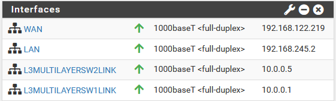

<br>

## Installing and Configuring the FRR Package

The FRR (Free Range Routing) package is the package needed to run routing protocols including OSPF. We must install and configure FRR before configuring OSPF.

### Install FRR

- Go to System → Package Manager → Available Packages
- Search for frr
- Click Install next to the FRR package
- Click confirm

Once it is installed, FRR options will appear under the Services tab.

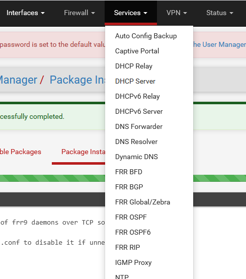

### Configure FRR

The FRR global settings must be configured before OSPF. The Default Router ID will be 3.3.3.3, keeping the same pattern as our core switches. The master password will be the same as used in the rest of the lab for simplicity. Syslog logging will be important for when Syslog is configured later.

- Go to Services → FRR Global/Zebra
- Click Enable FRR
- Set the Default Router ID to 3.3.3.3
- Set a Master Password
- Check Syslog Logging
- Leave all others as default
- Click Save

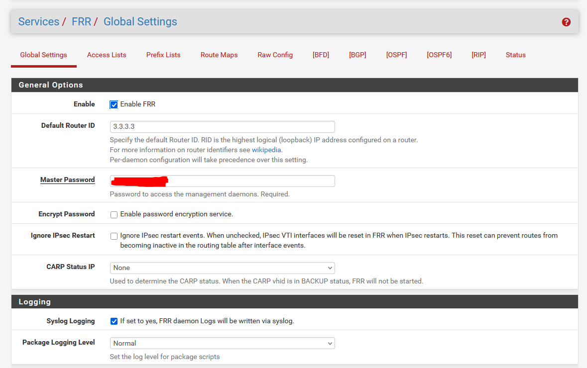

<br>

## Configuring OSPF

pfSense will form an OSPF adjacency with both core switches through the OPT1 and OPT2 point-to-point interfaces. It will also advertise a default route into the network so devices can access the internet.

### Enable OSPF

- Go to Services → FRR OSPF
- Check Enable OSPF Routing
- Check Log Adjacency Changes
- Set the Router ID to 3.3.3.3
- Under Default Route Distribution check Redistribute Default
- Leave all other settings as default
- Click Save

**Note:** Do not configure the OSPF networks here, we will configure them through the interfaces.

### Configure OSPF Interfaces

OSPF should be enabled on OPT1 (em2) and OPT2 (em3) only. em1 will be set to passive since no OSPF neighbors exist on that interface.

**OPT1 (em2):**

This is the interface that connects to L3-Multilayer-SW2.

- Go to Services → FRR OSPF → Interfaces
- Click Add
- In the Interface dropdown, select L3MultilayerSW2Link (or OPT1)
- In the Description, write Link to L3-Multilayer-SW2
- Set Network Type to Point-to-Point
- Check Ignore MTU
- Set Area to 0.0.0.0
- Leave other values as default
- Click Save

**OPT2 (em3):**

This is the interface that connects to L3-Multilayer-SW1

- Click Add
- In the Interface dropdown, select L3MultilayerSW1Link (or OPT2)
- In the Description, write Link to L3-Multilayer-SW1
- Set Network Type to Point-to-Point
- Check Ignore MTU
- Set Area to 0.0.0.0
- Leave other values as default
- Click Save

**LAN (em1):**

This is the link to the Cloud node

- Click Add
- In the Interface dropdown, select LAN
- In the Description, write Link to Cloud node
- Check Interface is Passive
- Set Area to 0.0.0.0
- Leave other values as default
- Click Save

**Completed Interfaces Example:**

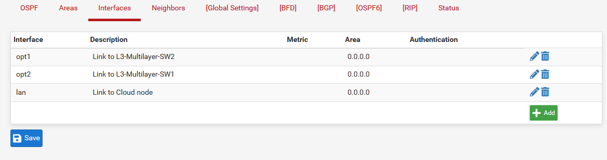

**Area Configuration:**

We also need to configure the area in the Area tab.

- Go to Services →  FRR OSPF →  Areas
- Click Add
- Set Area to 0.0.0.0
- Set Area Type to Normal
- Leave other values as default
- Click Save

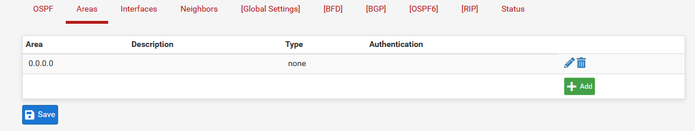

### Temporary Firewall Rules for OSPF Adjacency

There are no current firewall rules configured, so that means all traffic on these interfaces will be blocked by default. We will need to temporarily add allow all rules on both OPT1 and OPT2 for the OSPF traffic to reach pfSense.

**Add Allow Rule on L3MultilayerSW2Link (OPT1):**

- Go to Firewall → Rules → L3MultilayerSW2Link
- Click Add
- Set Action to Pass
- Set Interface to L3MultilayerSW2Link
- Set Protocol to Any
- Set Source to Any
- Set Destination to Any
- Leave other values as default
- Click Save then Apply Changes

**Add Allow Rule on L3MultilayerSW1Link (OPT2):**

- Go to Firewall → Rules → L3MultilayerSW1Link
- Click Add
- Repeat same steps as L3MultilayerSW2Link (OPT1)
- Click Save then Apply Changes

Adding these rules will allow the OSPF adjacency to form accross both links which we will confirm in the Verification part of this section.

<br>

## Configure NAT Settings

pfSense will handle NAT for devices reaching the internet through its WAN interface. We must configure NAT settings to allow all end devices internet access.

- Go to Firewall → NAT → Outbound
- Change the Outbound NAT Mode to Hybrid Outbound NAT rule generation
- Click Save and Apply Changes
- Under the Mappings section, click Add
- Set the Interface to WAN
- Set the Source to Network or Alias
- In the box next to Network or Alias type 192.168.0.0 with a /16 mask
- Set Destination to Any
- In Description type Internal VLAN NAT
- Click Save then Apply Changes

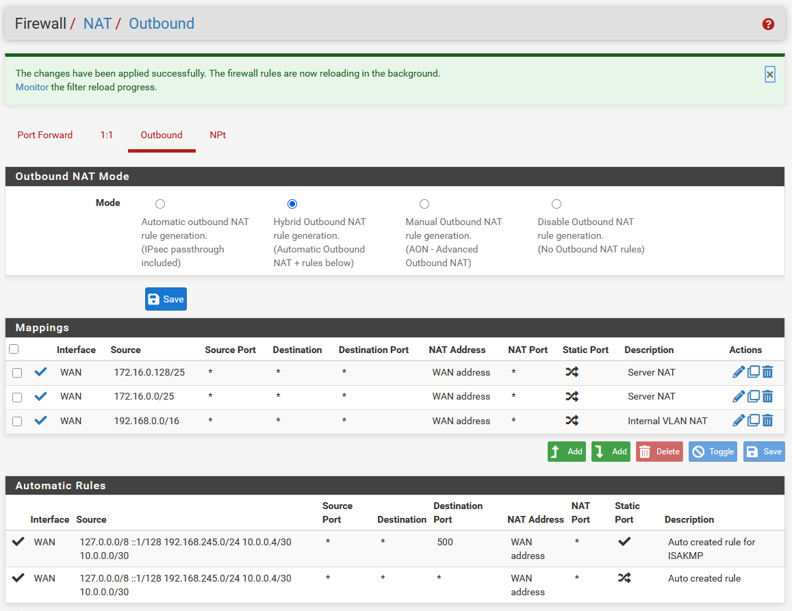

<br>

## Verification

After OSPF was configured on pfSense we can verify the switches can see it as an OSPF neighbor. We can also verify the default route was configured.

### Verify OSPF Adjacency

On both L3-Multilayer-SW1 and L3-Multilayer-SW2, run:
```
show ip ospf neighbor
```

pfSense should now appear with a router ID of 3.3.3.3 and should show a state FULL.

If it does not appear as a neighbor, confirm:

- FRR is enabled in FRR Global/Zebra settings
- OSPF is enabled and Redistribute Default is checked in FRR OSPF settings
- L3MultilayerSW2Link (OPT1) and L3MultilayerSW1Link (OPT2) are correctly configured in FRR OSPF Interfaces settings
- The temporary allow all firewall rules are added on both L3MultilayerSW2Link and L3MultilayerSW1Link interfaces in Firewall Rules settings

**L3-Multilayer-SW1 OSPF Neighbors:**

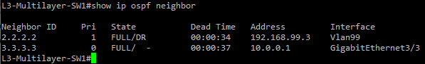

**L3-Multilayer-SW2 OSPF Neighbors:**

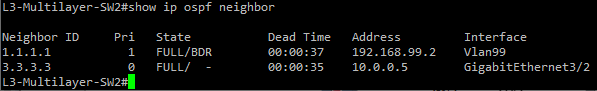

### Verify Default Route

On both L3-Multilayer-SW1 and L3-Multilayer-SW2, run:
```
show ip route ospf
```

A default route should now appear because it was learned by OSPF.

**L3-Multilayer-SW1 Default Route:**

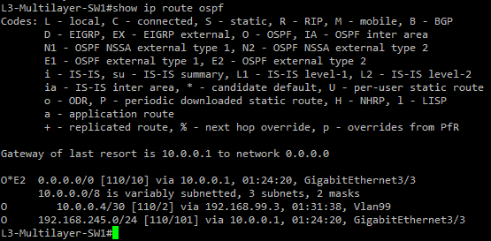

This shows the next hop is 10.0.0.1 (em3)

**L3-Multilayer-SW2 Default Route:**

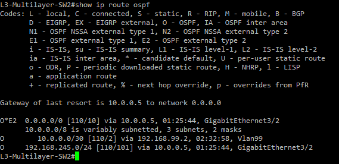

This shows the next hop is 10.0.0.5 (em2)

<br>

## Ping Testing Verification

### L3-Multilayer-SW1 ping pfSense em3 interface
```
ping 10.0.0.1
```
A successful ping confirms connectivity to pfSense L3MultilayerSW1Link (em3/OPT2) interface.

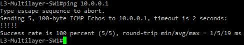

### L3-Multilayer-SW2 ping pfSense em2 interface
```
ping 10.0.0.5
```
A successful ping confirms connectivity to pfSense L3MultilayerSW2Link (em2/OPT1) interface.

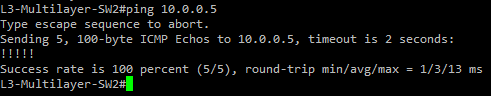

### Any VPCS workstation ping internet IP
```
ping 8.8.8.8
```
A successful ping confirms internet connectivity on department workstations.

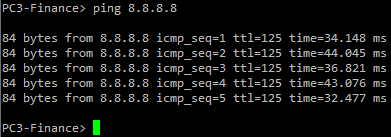

### PC1-HR (VLAN 10) ping PC4-IT (VLAN 40)
```
ping 192.168.3.10
```
A successful ping confirms that inter-VLAN routing is still working.

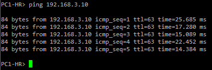
