# DHCP Configuration

DHCP (Dynamic Host Configuration Protocol) automatically assigns IP addresses to devices when they connect to the network. Without it, all of the department workstations would need to be manually configured with ip addresses, subnet masks, default gateways, and other network settings like DNS and NTP servers. The Ubuntu-Infra-Server will be acting as the DHCP server for each department VLAN and be assigning available addresses from the DHCP pool once the device connects to the network. Since the DHCP server is on a separate VLAN, the layer 3 core switches will relay the DHCP requests to the server.

This section will cover configuring a static IP on Ubuntu-Infra-Server, installing isc-dhcp-server on Ubuntu-Infra-Server, configuring the DHCP pools for the department VLANs, configuring DHCP relay using 'ip helper-address' on the layer 3 core switches, verifying the workstations receive addresses through DHCP, and confirming network connectivity through ping testing.

<br>

## DHCP Table

We are saving 10 addresses for network infrastructure devices now and potential future devices, and setting the rest of the addresses .11 - .254 to the DHCP pool.

| VLAN | Subnet | Pool Range | Gateway |
|------|--------|------------|---------|
| 10 - HR | 192.168.0.0/24 | 192.168.0.11 - 192.168.0.254 | 192.168.0.1
| 20 - Sales | 192.168.1.0/24 | 192.168.1.11 - 192.168.1.254 | 192.168.1.1
| 30 - Finance | 192.168.2.0/24 | 192.168.2.11 - 192.168.2.254 | 192.168.2.1 |
| 40 - IT | 192.168.3.0/24 | 192.168.3.11 - 192.168.3.254 | 192.168.3.1 |

<br>

## Configuring a Static IP on Ubuntu-Infra-Server

Before configuring DHCP, we will need to set a static IP address on the Ubuntu-Infra-Server. The IP address we configured for ping testing in section 07 is only temporary and will be removed once the device reboots. We will now configure the IP address to stay even after a reboot.

### Log in to Ubuntu-Infra-Server using default credentials

Username: ubuntu

Password: ubuntu

### Disable cloud-init network management

Disabling cloud-init network management prevents the system from overwriting the static IP on reboot.

Command:
```
sudo nano /etc/cloud/cloud.cfg.d/99-disable-network-config.cfg
```
In this file, add the line:
```
network: {config: disabled}
```
Then save the file with Ctrl+X, then Y, then press enter.

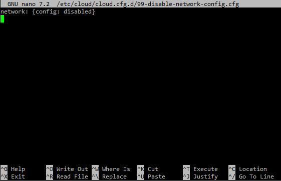

### Edit netplan configuration file

To set the new IP address, we must edit the netplan configuration file.

Command:
```
sudo nano /etc/netplan/50-cloud-init.yaml
```
Replace the file contents with this:
```
network:
  version: 2
  ethernets:
    ens3:
      addresses:
        - 172.16.0.5/25
      routes:
        - to: default
          via: 172.16.0.1
      nameservers:
        addresses:
          - 8.8.8.8
          - 8.8.4.4
```
**Note:** A temporary public DNS server is required in order to update the package list.

Then save the file with Ctrl+X, then Y, then enter.


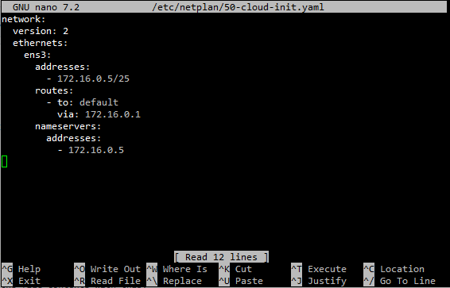

Apply the new configuration using the command:
```
sudo netplan apply
```

### Verify new IP address

Verify the newly configured IP address with:
```
ip addr show
```

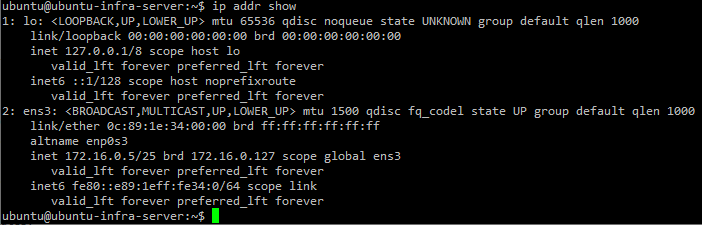

<br>

## Installing isc-dhcp-server on Ubuntu-Infra-Server

First we update then install isc-dhcp-server using:
```
sudo apt update
sudo apt install isc-dhcp-server -y
```

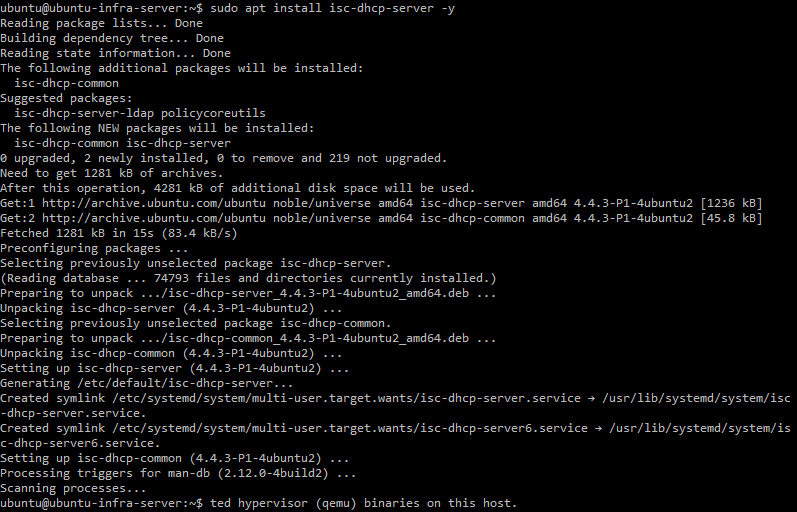

<br>

## Configuring DHCP Interface Binding

To set the network interface for the DHCP server, we need to edit the interface file.

Command:
```
sudo nano /etc/default/isc-dhcp-server
```
Change the line that says INTERFACESv4="" to:
```
INTERFACESv4="ens3"
```
Save the file with Ctrl+X, then Y, then enter.

The DHCP interface is now set to the interface of our server.

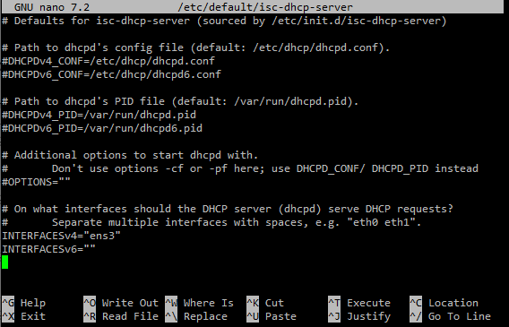

<br>

## Configuring DHCP Pools

We can now configure our DHCP pools by editing the main DHCP configuration file. Even though there is no pools in VLAN 50, we still have to declare it in the settings because it is the subnet the DHCP server interface is connected to. We then declare each pool with the network address of the subnet, subnet mask, DHCP pool range, and default gateway.

Command:
```
sudo nano /etc/dhcp/dhcpd.conf
```

Edit the file to:
```
# DHCP Server Configuration

authoritative;
default-lease-time 86400;
max-lease-time 86400;

# DNS and NTP server
option domain-name "ecorp.local";
option domain-name-servers 172.16.0.5;
option ntp-servers 172.16.0.5;

# VLAN 50 - Infrastructure Server subnet (no pool)
subnet 172.16.0.0 netmask 255.255.255.128 {
}

# VLAN 10 - HR Department
subnet 192.168.0.0 netmask 255.255.255.0 {
    range 192.168.0.11 192.168.0.254;
    option routers 192.168.0.1;
}

# VLAN 20 - Sales Department
subnet 192.168.1.0 netmask 255.255.255.0 {
    range 192.168.1.11 192.168.1.254;
    option routers 192.168.1.1;
}

# VLAN 30 - Finance Department
subnet 192.168.2.0 netmask 255.255.255.0 {
    range 192.168.2.11 192.168.2.254;
    option routers 192.168.2.1;
}

# VLAN 40 - IT Department
subnet 192.168.3.0 netmask 255.255.255.0 {
    range 192.168.3.11 192.168.3.254;
    option routers 192.168.3.1;
}
```
Save the file with Ctrl+X, then Y, then enter.

**Note:** The DNS and NTP server options point to the Ubuntu-Infra-Server itself at 172.16.0.5. The end devices will receive the DNS and NTP server address in their DHCP lease but they will not work until section 10 is completed.

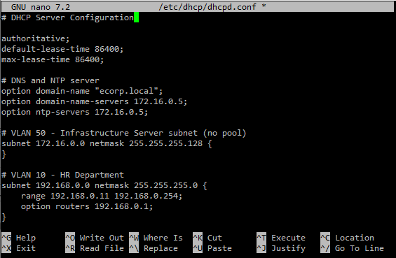

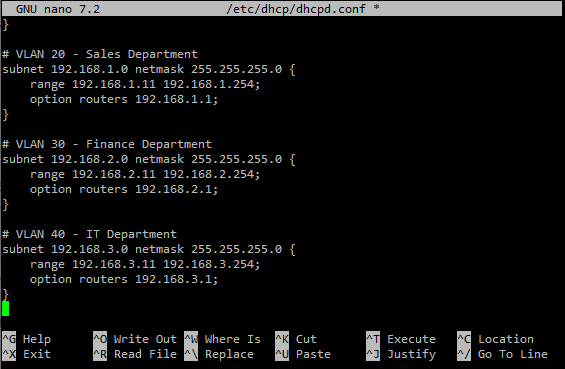

<br>

## Start the isc-dhcp-server Service

Start the DHCP server and enable it to start automatically using:
```
sudo systemctl start isc-dhcp-server
sudo systemctl enable isc-dhcp-server
```

The verify the service is running by using:
```
systemctl status isc-dhcp-server
```

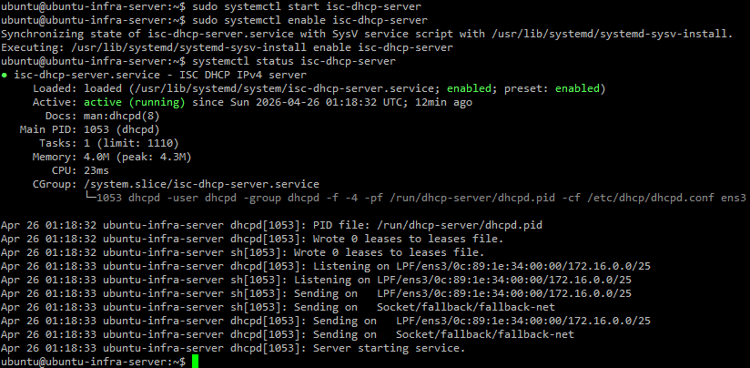

<br>

## Configuring DHCP relay

Each layer 3 core switch needs to be able to relay the DHCP request to the DHCP server. Because the end devices are on a different subnet, each SVI on each layer 3 core switch needs the IP helper-address command so they know where to relay the DHCP request to.

The helper address must be configured on both layer 3 switches for every department VLAN SVI even if it is not the active switch for that VLAN. If one switch goes down, the other knows where to relay the DHCP request.

### L3-Multilayer-SW1

```
enable
configure terminal

interface Vlan10
ip helper-address 172.16.0.5
exit

interface Vlan20
ip helper-address 172.16.0.5
exit

interface Vlan30
ip helper-address 172.16.0.5
exit

interface Vlan40
ip helper-address 172.16.0.5
exit
do write
```

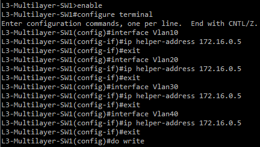

### L3-Multilayer-SW2

```
enable
configure terminal

interface Vlan10
ip helper-address 172.16.0.5
exit

interface Vlan20
ip helper-address 172.16.0.5
exit

interface Vlan30
ip helper-address 172.16.0.5
exit

interface Vlan40
ip helper-address 172.16.0.5
exit
do wr
```

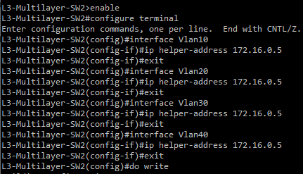

<br>

## Verification

The VPCS currently have static IP addresses from prior ping tests. We will now set them to receive addresses from DHCP.

To request an IP address via DHCP on PC1-HR, PC2-Sales, PC3-Finance, and PC4-IT, run:
```
ip dhcp
```
**Note:** In my test, PC1-HR could not locate the DHCP server on the first attempt. It sent out the discover and offer, but dropped after that and did not complete the rest of the sequence. Running 'ip dhcp' again worked and it successfully recieved an IP address via DHCP.

To confirm the workstations received the correct addresses, run:
```
show ip
```

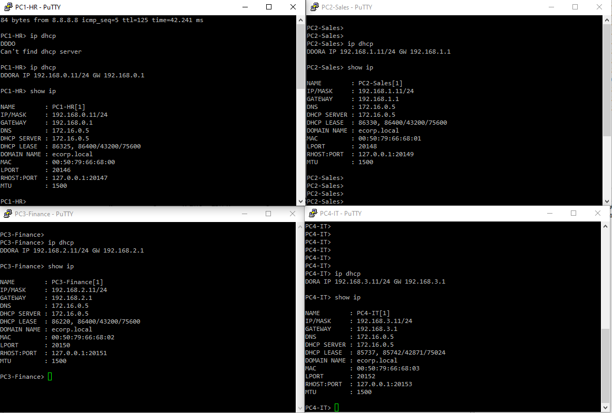

<br>

## Ping Testing Verification

We will confirm connectivity on department workstations after receiving addresses via DHCP.

### PC1-HR

**PC1-HR ping default gateway**
```
ping 192.168.0.1
```
**PC1-HR ping internet**
```
ping 8.8.8.8
```
**PC1-HR ping a different workstation**
```
ping 192.168.2.11
```

A successful ping will confirm DHCP is working correctly on this device.

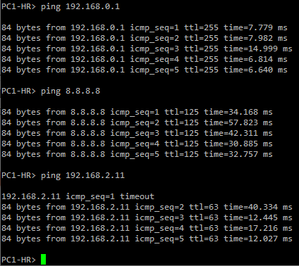

### PC2-Sales

**PC2-Sales ping default gateway**
```
ping 192.168.1.1
```
**PC2-Sales ping internet**
```
ping 8.8.8.8
```
**PC2-Sales ping a different workstation**
```
ping 192.168.3.11
```

A successful ping will confirm DHCP is working correctly on this device.

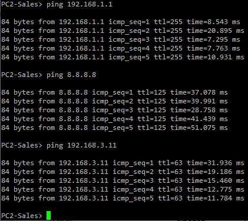

### PC3-Finance

**PC3-Finance ping default gateway**
```
ping 192.168.2.1
```
**PC3-Finance ping internet**
```
ping 8.8.8.8
```
**PC3-Finance ping a different workstation**
```
ping 192.168.0.11
```

A successful ping will confirm DHCP is working correctly on this device.

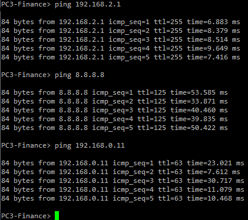

### PC4-IT

**PC4-IT ping default gateway**
```
ping 192.168.3.1
```
**PC4-IT ping internet**
```
ping 8.8.8.8
```
**PC4-IT ping a different workstation**
```
ping 192.168.1.11
```

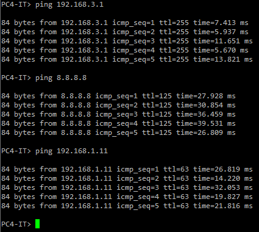

A successful ping will confirm DHCP is working correctly on this device.
