# DNS, HTTP, NTP Infrastructure Services Configuration

DNS, HTTP, and NTP services must be configured for the network to function properly. DNS will resolve the hostnames to their IP address, HTTP will provide a internal web server that serves a simple internal site, and NTP will keep all devices synchronized to the same time so the Syslog logs will show the accurate time. the Ubuntu-Admin-PC will need to be configured with a static IP address in order to verify configuration.

This section will cover installing and configuring the bind9 DNS server, installing and configuring the chrony NTP server, updating the name server address on Ubuntu-Infra-Server, the static IP address configuration of the Ubuntu-Admin-PC, configuring NTP on each switch and pfSense, installing and configuring the apache2 web server, and verifying the configurations were successful.

<br>

## DNS Records Table

| Device | Hostname | IP Address |
|--------|----------|------------|
| Ubuntu-Infra-Server | ubuntu-infra-server.ecorp.local | 172.16.0.5 |
| Ubuntu-Mon-Server | ubuntu-mon-server.ecorp.local | 172.16.0.135 |
| Ubuntu-Admin-PC | ubuntu-admin-pc.ecorp.local | 192.168.99.10 |
| L3-Multilayer-SW1 | l3-multilayer-sw1.ecorp.local | 192.168.99.2 |
| L3-Multilayer-SW2 | l3-multilayer-sw2.ecorp.local | 192.168.99.3 |
| L2-SW1 | l2-sw1.ecorp.local | 192.168.99.4 |
| L2-SW2 | l2-sw2.ecorp.local | 192.168.99.5 |
| L2-SW3 | l2-sw3.ecorp.local | 192.168.99.6 |
| pfSense | pfsense.ecorp.local | 192.168.245.2 |

<br>

## Installing and Configuring bind9 on Ubuntu-Infra-Server

The bind9 DNS server will be installed and configured and allow the devices to access resources using hostnames instead of IP addresses.

<br>

Log into Ubuntu-Infra-Server using the default credentials:

Username: ubuntu

Password: ubuntu

### Configure a hostname

A hostname will be configured to allow easy recognition of the device from the terminal.

<br>

Then change the hostname using the command:
```
sudo hostnamectl set-hostname infra-server
```
**Note:** The hostname will be updated after a reboot.

Then add the hostname to the hosts file using the command:
```
sudo nano /etc/hosts
```

After the 127.0.0.1 localhost line, add:
```
127.0.1.1 infra-server
```
Then save with Ctrl+X, then y, then enter.

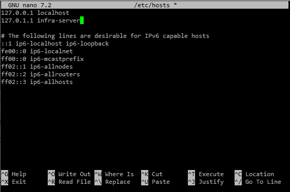

### Install bind9

Install bind9 using the commands:
```
sudo apt update
sudo apt install bind9 bind9utils -y
```

### Configure bind9 options

By editing the bind9 options file we will restrict bind9 to listen only on the VLAN 50 interface, set bind9 to forward any queries it cannot resolve to Google's DNS servers, restrict recursive queries to only internal subnets, and restrict which clients can send queries to only internal subnets.

<br>

The command to edit the bind9 options file is:
```
sudo nano /etc/bind/named.conf.options
```

Edit the file to:
```
options {
    directory "/var/cache/bind";

    // Forward external queries to Google DNS
    forwarders {
        8.8.8.8;
        8.8.4.4;
    };

    // Listen on VLAN 50 interface only
    listen-on { 172.16.0.5; };
    listen-on-v6 { none; };

    // Allow recursion for internal subnets only
    allow-recursion {
        192.168.0.0/16;
        172.16.0.0/16;
        127.0.0.1;
    };

    // Allow queries from internal subnets
    allow-query {
        192.168.0.0/16;
        172.16.0.0/16;
        127.0.0.1;
    };

    dnssec-validation no;
    recursion yes;
};
```
Then save with Ctrl+X, then y, then enter.

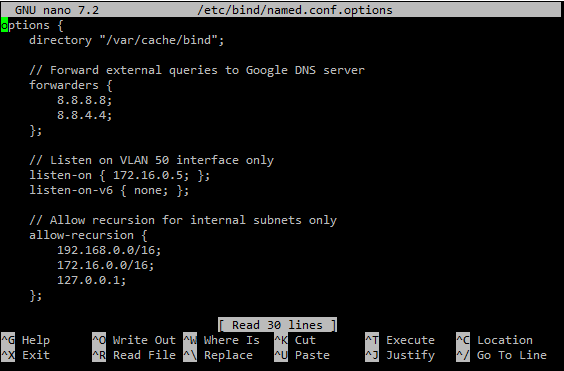

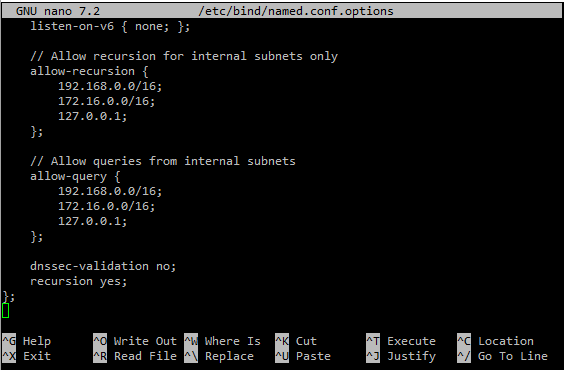

### Configure forward and reverse zones

The forward zone will map hostnames to IPv4 addresses inside our domain ecorp.local and the reverse zone will map IPv4 addresses back to hostnames.

<br>

Edit the zones configuration file using the command:
```
sudo nano /etc/bind/named.conf.local
```

Edit the file to add the forward zone, reverse zone for 192.168.0.0/16, and reverse zone for 172.16.0.0/25.
```
// Forward zone
zone "ecorp.local" {
    type master;
    file "/etc/bind/db.ecorp.local";
};

// Reverse zone for 192.168.0.0/16
zone "168.192.in-addr.arpa" {
    type master;
    file "/etc/bind/db.192.168";
};

// Reverse zone for 172.16.0.0/25
zone "16.172.in-addr.arpa" {
    type master;
    file "/etc/bind/db.172.16";
};
```
Then save with Ctrl+X, then y, then enter.

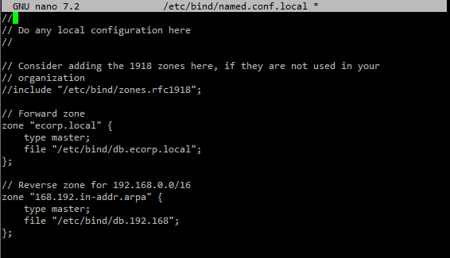

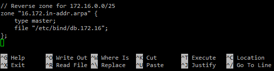

Then create the forward zone file using the command:
```
sudo nano /etc/bind/db.corp.local
```

Edit the file to:
```
$TTL    86400
@       IN      SOA     ubuntu-infra-server.ecorp.local. admin.ecorp.local. (
                        2024010101  ; Serial
                        3600        ; Refresh
                        1800        ; Retry
                        604800      ; Expire
                        86400 )     ; Negative TTL

; Name servers
@       IN      NS      ubuntu-infra-server.ecorp.local.

; Ubuntu Servers
ubuntu-infra-server     IN      A       172.16.0.5
ubuntu-mon-server       IN      A       172.16.0.135
ubuntu-admin-pc         IN      A       192.168.99.10

; Core Switches
l3-multilayer-sw1       IN      A       192.168.99.2
l3-multilayer-sw2       IN      A       192.168.99.3

; Access Switches
l2-sw1                  IN      A       192.168.99.4
l2-sw2                  IN      A       192.168.99.5
l2-sw3                  IN      A       192.168.99.6

; pfSense Firewall
pfsense                 IN      A       192.168.245.2

; Web server alias
www                     IN      CNAME   ubuntu-infra-server.ecorp.local.
```
Then save with Ctrl+X, then y, then enter.

**Note:** This file ensures that a query to the device name (e.g ubuntu-infra-server) returns the correct IP address.

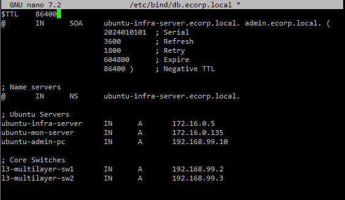

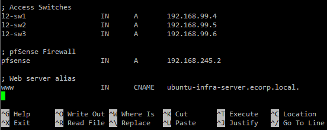

Now create the reverse zone file for the 192.168.0.0/16 addresses.
```
sudo nano /etc/bind/db.192.168
```

And edit the file to:
```
$TTL    86400
@       IN      SOA     ubuntu-infra-server.ecorp.local. admin.ecorp.local. (
                        2024010101  ; Serial
                        3600        ; Refresh
                        1800        ; Retry
                        604800      ; Expire
                        86400 )     ; Negative TTL

; Name servers
@       IN      NS      ubuntu-infra-server.ecorp.local.

; PTR Records
10.99   IN      PTR     ubuntu-admin-pc.ecorp.local.
2.99    IN      PTR     l3-multilayer-sw1.ecorp.local.
3.99    IN      PTR     l3-multilayer-sw2.ecorp.local.
4.99    IN      PTR     l2-sw1.ecorp.local.
5.99    IN      PTR     l2-sw2.ecorp.local.
6.99    IN      PTR     l2-sw3.ecorp.local.
```
Then save with Ctrl+X, then y, then enter.

**Note:** This file ensures that reverse lookups on 192.168 IP addresses resolve to the correct hostname.

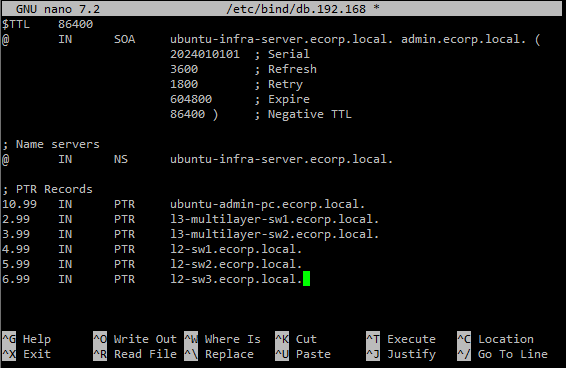

Then create the reverse zone file for the 172.16.0.0/25 addresses.
```
sudo nano /etc/bind/db.172.16
```

And edit the file to:
```
$TTL    86400
@       IN      SOA     ubuntu-infra-server.ecorp.local. admin.ecorp.local. (
                        2024010101  ; Serial
                        3600        ; Refresh
                        1800        ; Retry
                        604800      ; Expire
                        86400 )     ; Negative TTL

; Name servers
@       IN      NS      ubuntu-infra-server.ecorp.local.

; PTR Records
5.0     IN      PTR     ubuntu-infra-server.ecorp.local.
135.0   IN      PTR     ubuntu-mon-server.ecorp.local.
```
Then save with Ctrl+X, then y, then enter.

**Note:** This file ensures that reverse lookups on the 172.16.0.0/25 IP addresses resolve to the correct hostname.

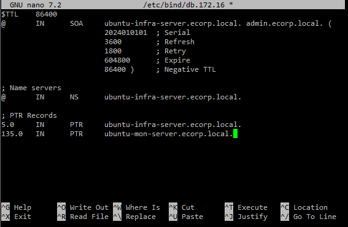

### Check for configuration errors

Before starting the service, we should check for configuration errors using the commands:
```
sudo named-checkconf /etc/bind/named.conf
sudo named-checkzone ecorp.local /etc/bind/db.ecorp.local
sudo named-checkzone 168.192.in-addr.arpa /etc/bind/db.192.168
sudo named-checkzone 16.172.in-addr.arpa /etc/bind/db.172.16
```
**Note:** Make sure to fix any configuration errors before starting the service.

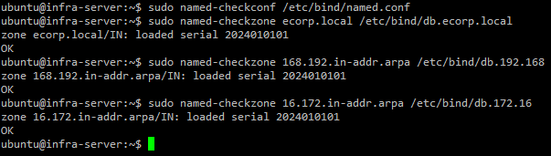

### Start and enable the bind9 service

bind9 is technically an alias name and might not work with all systemctl commands. We will be using the actual daemon name "named" to start the service.

<br>

To start bind9 and enable on startup, use the commands:
```
sudo systemctl enable named
sudo systemctl restart named
```

Then we can verify it is running using the command:
```
systemctl status named --no-pager -l
```

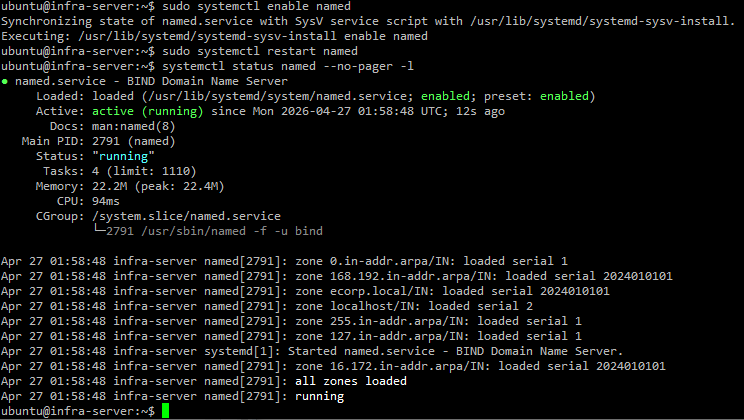

<br>

## Installing and Configuring chrony on Ubuntu-Infra-Server

chrony is the NTP software we will be using to sync time across devices.

<br>

### Install chrony

Install chrony using the command:
```
sudo apt install chrony -y
```

### Configure chrony

Edit the configuration file using the command:
```
sudo nano /etc/chrony/chrony.conf
```
Replace all 4 pool lines with:
```
pool pool.ntp.org iburst minpoll 4 maxpoll 6
```
Then directly under that line, we allow internal subnets to use this server using:
```
allow 192.168.0.0/16
allow 172.16.0.0/16
```

Then change the makestep 1 3 line to:
```
makestep 1 -1
```
Then save with Ctrl+X, then y, then enter.

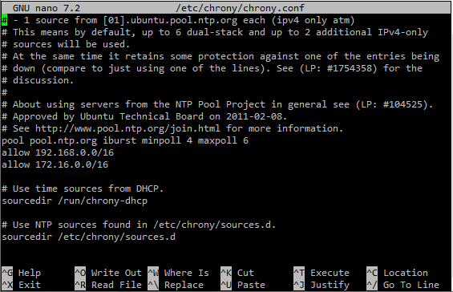

### Configure a timezone (EDT/EST)

To set the timezone to US Eastern time, use the command:
```
sudo timedatectl set-timezone America/New_York
```
You can verify this change was applied using the command:
```
timedatectl
```

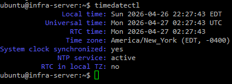

### Restart, enable, and verify chrony

Restart and enable the service using:
```
sudo systemctl restart chrony
sudo systemctl enable chrony
```

Verify chrony is syncing time using the command:
```
chronyc tracking
```
**Note:** This command will still show the UTC time even with a timezone configured.

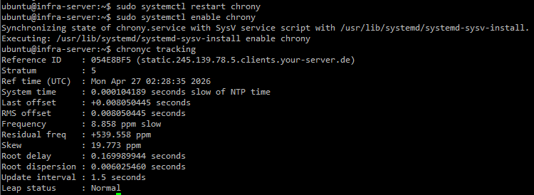

<br>

## Update Nameserver in Ubuntu-Infra-Server Network Configuration

Now that the bind9 DNS server is running, we can change the nameservers in the network configuration on Ubuntu-Infra-Server to point to itself as the nameserver. We set bind9 to forward external queries to Google's DNS so that we no longer need them in the network configuration.

<br>

### Edit network configuration

To edit the network configuration use the command:
```
sudo nano /etc/netplan/50-cloud-init.yaml
```

Change the address under nameservers to:
```
- 172.16.0.5
```
Then save with Ctrl+X, then y, then enter.

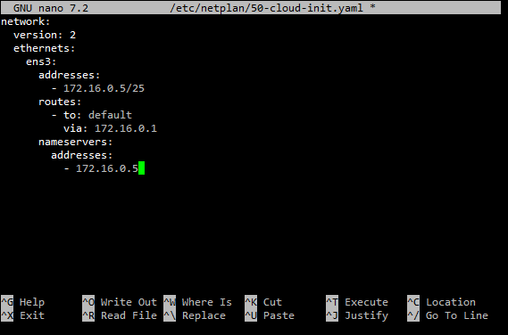

### Apply the configuration

Apply the new config using the command:
```
sudo netplan apply
```

### Bypass systemd-resolved

We need to bypass systemd-resolved so DNS queries get forwarded to the DNS server directly.

<br>

To bypass systemd-resolved, use the commands:
```
sudo unlink /etc/resolv.conf
sudo nano /etc/resolv.conf
```
In this file, add:
```
nameserver 172.16.0.5
```
Save with Ctrl+X, then y, then enter.

**Note:** This forces queries to be forwarded to the nameserver at 172.16.0.5 directly.

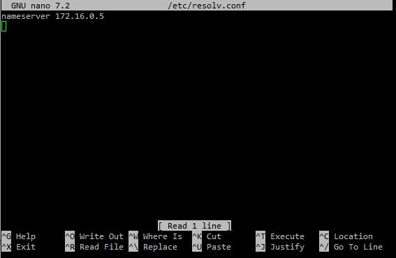

### Verify DNS resolution

DNS resolution should be working correctly on Ubuntu-Infra-Server.

<br>

To verify, run the commands:
```
nslookup ubuntu-infra-server.ecorp.local
nslookup google.com
nslookup l3-multilayer-sw1.ecorp.local
```

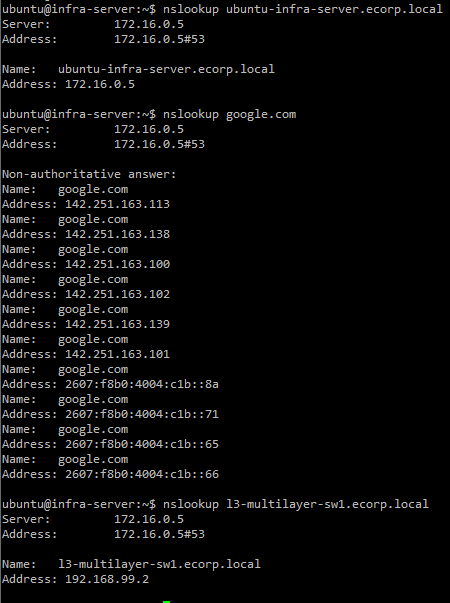

<br>

## Configuring Ubuntu-Admin-PC

The Ubuntu-Admin-PC will need to be configured with a permanent static IP address to verify the services configured in this section and have chrony NTP installed.

Log into Ubuntu-Admin-PC using the default credentials:

Username: ubuntu

Password: ubuntu

### Configure a hostname

Change the hostname using the command:
```
sudo hostnamectl set-hostname admin-pc
```
**Note:** The hostname will be updated after a reboot.

Update the hosts file using the command:
```
sudo nano /etc/hosts
```
After the 127.0.0.1 localhost line, add:
```
127.0.1.1 admin-pc
```
Then save with Ctrl+X, then y, then enter.

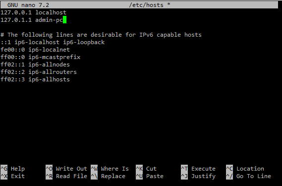

### Disable cloud-init network management

Like before, we need to disable cloud-init to prevent the system from overwriting the IP.

Commands:
```
sudo nano /etc/cloud/cloud.cfg.d/99-disable-network-config.cfg
```
Then add:
```
network: {config: disabled}
```
Save the file with Ctrl+X, then Y, then enter.

### Configure a static IP

We will use the IP address of 192.168.99.10 and a default gateway of 192.168.99.1, as written in section 02.

<br>

To configure a static IP, use the command:
```
sudo nano /etc/netplan/50-cloud-init.yaml
```

Then edit the file to:
```
network:
  version: 2
  ethernets:
    ens3:
      addresses:
        - 192.168.99.10/24
      routes:
        - to: default
          via: 192.168.99.1
      nameservers:
        addresses:
          - 172.16.0.5
```
Then save with Ctrl+X, then y, then enter.

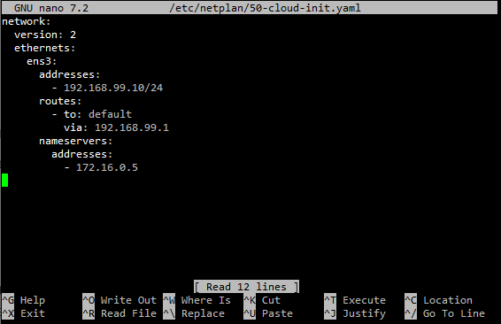

Then apply the configuration with the command:
```
sudo netplan apply
```

### Bypass systemd-resolved

Just like Ubuntu-Infra-Server, we need to bypass systemd-resolved so DNS queries will get forwarded to the DNS server directly.

<br>

Use the commands:
```
sudo unlink /etc/resolv.conf
sudo nano /etc/resolv.conf
```

In this file, add:
```
nameserver 172.16.0.5
```
Then save with Ctrl+X, then y, then enter.

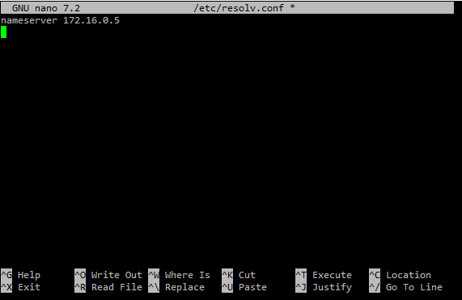

Then verify the new IP address using the command:
```
ip addr show
```

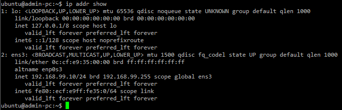

### Install and configure chrony

To install chrony, use the command:
```
sudo apt update
sudo apt install chrony -y
```

Then configure chrony to use Ubuntu-Infra-Server as the NTP source with the command:
```
sudo nano /etc/chrony/chrony.conf
```

Replace all 4 of the pool lines with:
```
server 172.16.0.5 iburst minpoll 4 maxpoll 6
```

Then change the makestep 1 3 line to:
```
makestep 1 -1
```
Then save with Ctrl+X, then y, then enter.

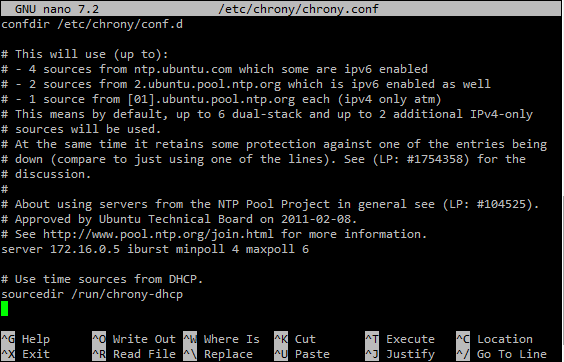

Restart and enable chrony to run on startup with the commands:
```
sudo systemctl restart chrony
sudo systemctl enable chrony
```

Set the timezone to US Eastern time with the command:
```
sudo timedatectl set-timezone America/New_York
```

To verify the timezone is set and chrony is syncing, use the commands:
```
timedatectl
chronyc tracking
```

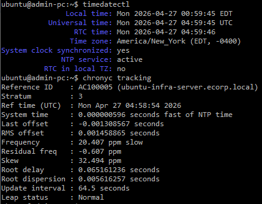

<br>

## Configuring NTP on the Switches

All five switches need to be configured to sync time from Ubuntu-Infra-Server. We are setting the minpoll and maxpoll options to poll more frequently to help reduce the clock offset in the lab environment.

**IMPORTANT NOTE:** The virtual Cisco IOSvL2 switches in GNS3 have a known clock drift issue. The switch clock will drift too quickly to maintain synchronization with NTP. This is a GNS3 virtualization issue and will not reflect real network behavior. On physical switches NTP would synchronize correctly. The NTP configuration is correct and the server is working, we saw this by confirming the Ubuntu-Admin-PC syncing from the Ubuntu-Infra-Server. This switch NTP configuration demonstrates the correct switch configuration in a company environment, even though full synchronization will not be achieved on the switches in this virtual environment. I tried troubleshooting this issue for a while and could not find a fix.

### L3-Multilayer-SW1
```
enable
configure terminal

ntp server 172.16.0.5 minpoll 4 maxpoll 6 prefer
do write
```

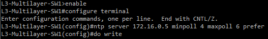

### L3-Multilayer-SW2
```
enable
configure terminal

ntp server 172.16.0.5 minpoll 4 maxpoll 6 prefer
do write
```

### L2-SW1
```
enable
configure terminal

ntp server 172.16.0.5 minpoll 4 maxpoll 6 prefer
do write
```

### L2-SW2
```
enable
configure terminal

ntp server 172.16.0.5 minpoll 4 maxpoll 6 prefer
do write
```

### L2-SW3
```
enable
configure terminal

ntp server 172.16.0.5 minpoll 4 maxpoll 6 prefer
do write
```


