# SNMP and Syslog Configuration

SNMP (Simple Network Management Protocol) allows a server to collect data from the devices in our network, such as device performance and health. The data it collects includes things like CPU usage, memory usage, uptime, and interface status. Since there is no device with a GUI in this lab, we will use manual polling to demonstrate the SNMP concept. Syslog allows our network devices and servers to send log information to a server for troubleshooting and monitoring. The syslog can log warning messages to a central server so device messages are easier to keep track of.

This section will cover configuring Ubuntu-Mon-Server with a static IP, hostname, and base services, installing and configuring snmpd on Ubuntu-Mon-Server, configuring SNMP on all switches, installing and configuring rsyslog on Ubuntu-Mon-Server, configuring Syslog on all switches, servers, and pfSense, and finally verify these services are functioning correctly. 

<br>

## Configuring Ubuntu-Mon-Server

Before other configuration, the monitoring server needs a static IP configured and other base services installed.

<br>

Log into Ubuntu-Mon-Server with the default credentials:

Username: ubuntu

Password: ubuntu

### Change the hostname

To change the hostname of Ubuntu-Mon-Server, use the command:
```
sudo hostnamectl set-hostname mon-server
```
**Note:** The hostname will update after the device is rebooted.

Then update the hosts file using the command:
```
sudo nano /etc/hosts
```

After 127.0.0.1 localhost, add the line:
```
127.0.1.1 mon-server
```
Then save with Ctrl+X, then y, then enter.

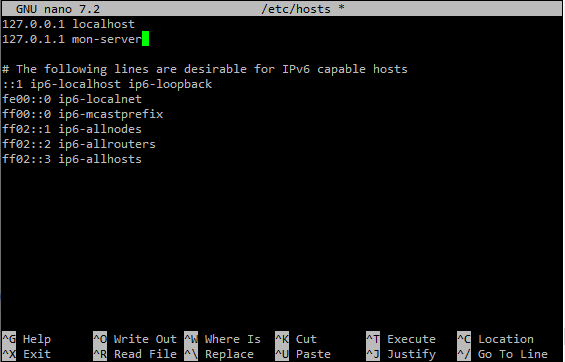

### Disable cloud-init network management

To disable cloud-init and prevent the system from overwriting the IP on boot, use the command:
```
sudo nano /etc/cloud/cloud.cfg.d/99-disable-network-config.cfg
```

Then add this in the file:
```
network: {config: disabled}
```
Then save with Ctrl+x, then y, then enter.

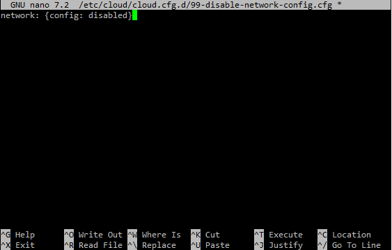

### Configure a Static IP

Configure a static IP address using the IP address from section 02.

Use the command:
```
sudo nano /etc/netplan/50-cloud-init.yaml
```

Then edit the file to this:
```
network:
  version: 2
  ethernets:
    ens3:
      addresses:
        - 172.16.0.135/25
      routes:
        - to: default
          via: 172.16.0.129
      nameservers:
        addresses:
          - 172.16.0.5
```
Then save with Ctrl+X, then y, then enter.

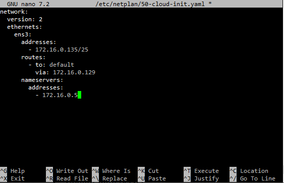

Apply the configuration using the command:
```
sudo netplan apply
```

### Configure a static resolv.conf

Configuring a static resolv.conf file ensures that DNS queries get forwarded directly to our DNS server.

Use the commands:
```
sudo unlink /etc/resolv.conf
sudo nano /etc/resolv.conf
```

Then add:
```
nameserver 172.16.0.5
```
Then save with Ctrl+X, then y, then enter.

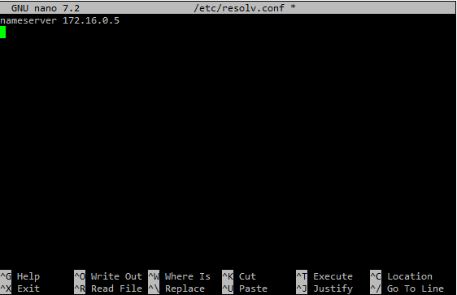

Then verify the new IP address and gateway using the commands:
```
ip addr show
ip route show
```

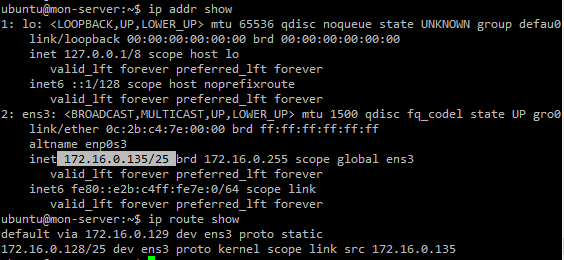

### Install and configure chrony

We need to install and configure chrony to use Ubuntu-Mon-Server as the time server to ensure a consistent time throughout the network devices.

Install using the commands:
```
sudo apt update
sudo apt install chrony -y
```

Then configure chrony to sync from Ubuntu-Infra-Server using the command:
```
sudo nano /etc/chrony/chrony.conf
```

Replace all 4 pool lines with 
```
server 172.16.0.5 iburst minpoll 4 maxpoll 6
```

Then change the makestep 1 3 line to:
```
makestep 1 -1
```
Then save with Ctrl+X, then y, then enter.

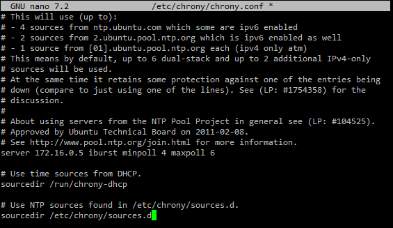

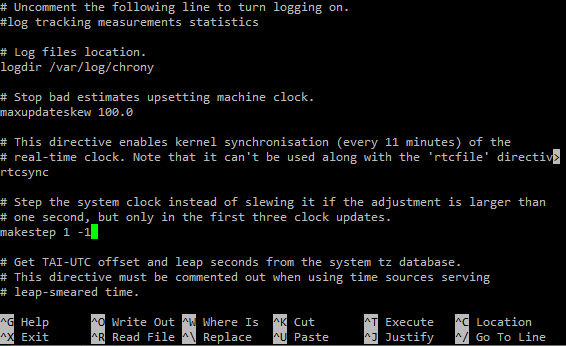

Now restart and enable chrony to start on boot using the commands:
```
sudo systemctl restart chrony
sudo systemctl enable chrony
```

Then we can set the timezone using the command:
```
sudo timedatectl set-timezone America/New_York
```

And now verify chrony is syncing using the command:
```
chronyc tracking
```

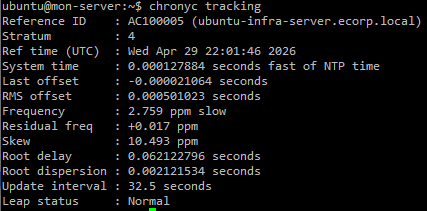

<br>

## Installing and Configuring snmpd on Ubuntu-Mon-Server

We will be installing and configuring snmpd to allow Ubuntu-Mon-Server to respond to SNMP queries.

### Install snmpd

To install snmpd, use the commands:
```
sudo apt update
sudo apt install snmpd snmp -y
```
**Note:** The snmp package has the tools needed to verify SNMP is functioning.

### Configure snmpd

To edit the snmpd configuration file, use the command:
```
sudo nano /etc/snmp/snmpd.conf
```

Change the line that says "agentaddress 127.0.0.1,[::1]" to:
```
agentaddress 172.16.0.135
```
**Note:** This sets snmpd to listen only on the VLAN 60 interface.

Then change the line that says "rocommunity public default -V systemonly" to:
```
rocommunity ecorpSNMP default -V systemonly
```
Then save with Ctrl+X, then y, then enter.

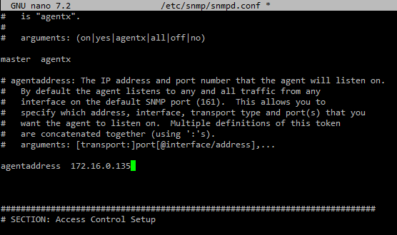

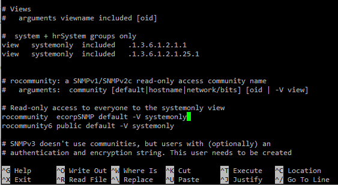

Now restart and enable snmpd to run on boot using the commands:
```
sudo systemctl restart snmpd
sudo systemctl enable snmpd
```

We can verify snmpd is running using the command:
```
sudo systemctl status snmpd --no-pager -l
```

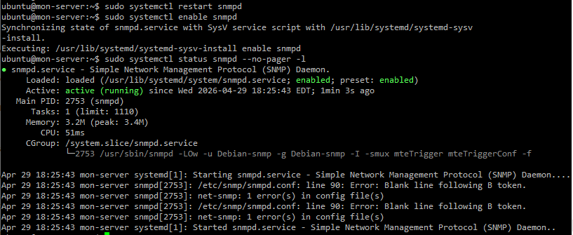

<br>

## Configuring SNMP on the Switches

All switches need SNMP configured to allow Ubuntu-Mon-Server to poll them for specific data. The switches also need to be able to send traps to Ubuntu-Mon-Server when an interface status changes. We are also configuring the switches to send the timestamp along with the interface change.

**Note:** SNMP version 3 is more secure and would always be used over version 2c in a production environment. However, we will be using SNMP version 2c for lab simplicity since we are only demonstrating the SNMP concept.

<br>

### L3-Multilayer-SW1

Commands:
```
enable
configure terminal

snmp-server community ecorpSNMP ro
snmp-server host 172.16.0.135 version 2c ecorpSNMP
snmp-server enable traps snmp linkdown linkup
service timestamps log datetime msec
logging on
exit
write
```
**Note:** I will only show a configuration example for L3-Multilayer-SW1 since the commands are the same for each switch.

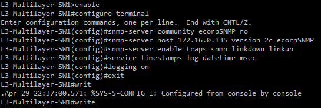

### L3-Multilayer-SW2

Commands:
```
enable
configure terminal

snmp-server community ecorpSNMP ro
snmp-server host 172.16.0.135 version 2c ecorpSNMP
snmp-server enable traps snmp linkdown linkup
service timestamps log datetime msec
logging on
exit
write
```

### L2-SW1

Commands:
```
enable
configure terminal

snmp-server community ecorpSNMP ro
snmp-server host 172.16.0.135 version 2c ecorpSNMP
snmp-server enable traps snmp linkdown linkup
service timestamps log datetime msec
logging on
exit
write
```

### L2-SW2

Commands:
```
enable
configure terminal

snmp-server community ecorpSNMP ro
snmp-server host 172.16.0.135 version 2c ecorpSNMP
snmp-server enable traps snmp linkdown linkup
service timestamps log datetime msec
logging on
exit
write
```

### L2-SW3

Commands:
```
enable
configure terminal

snmp-server community ecorpSNMP ro
snmp-server host 172.16.0.135 version 2c ecorpSNMP
snmp-server enable traps snmp linkdown linkup
service timestamps log datetime msec
logging on
exit
write
```

### Verify SNMP on each switch

Verify SNMP was configured correctly using the commands:
```
show snmp community
show snmp host
```
**Note:** I will only show verification on L3-Multilayer-SW2 and L2-SW1.

**Verification on L3-Multilayer-SW2:**

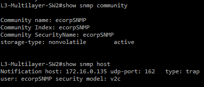

**Verification on L2-SW1:**

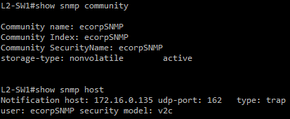

<br>

## Installing and Configuring rsyslog on Ubuntu-Mon-Server

rsyslog will receive log messages from devices and store them in a log file. Devices will have their own log file to make logs from each device easy to identify and look through.

<br>

### Install rsyslog

Install rsyslog using the command:
```
sudo apt update
sudo apt install rsyslog -y
```

### Create a log directory

To create the directory for remote device logs and set correct permissions for rsyslog, use the command:
```
sudo mkdir -p /var/log/remote
sudo chown -R syslog:adm /var/log/remote
sudo chmod 755 /var/log/remote
```

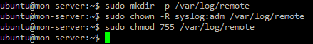

### Configure rsyslog

Edit the rsyslog configuration file using the command:
```
sudo nano /etc/rsyslog.conf
```

rsyslog needs to be able to receive messages on UDP port 514. To enable this, find and uncomment these lines by removing the # symbol:
```
module(load="imudp")
input(type="imudp" port="514")
```
**Note:** Do not change any value on these lines, simply remove the # before it.

Then save with Ctrl+X, then y, then enter.

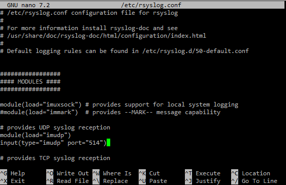

Now we need to create and configure a file for logging of the remote devices.

Create the configuration file by using the command:
```
sudo nano /etc/rsyslog.d/remote.conf
```
In the file, add this:
```
$template RemoteLogs,"/var/log/remote/%FROMHOST-IP%.log"
*.* -?RemoteLogs
```
Then save with Ctrl+X, then y, then enter.

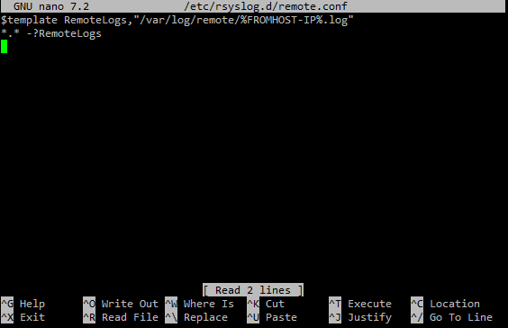

### Restart, enable, and verify rsyslog

Restart and enable rsyslog to run after booting by using the commands:
```
sudo systemctl restart rsyslog
sudo systemctl enable rsyslog
```

Verify rsyslog is running and listening on UDP port 514 using the commands:
```
sudo systemctl status rsyslog --no-pager -l
sudo ss -ulnp | grep 514
```

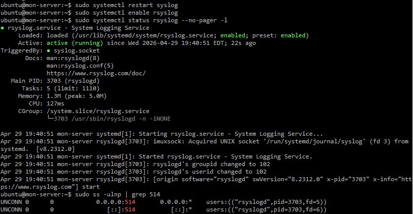

### Configure a logrotate file

To prevent log files from filling up all the space on the server, we will be rotating the log files to archive and compress the log file after one week and create a new log file.

Create a logrotate configuration file by using the command:
```
sudo nano /etc/logrotate.d/remote-logs
```
Then add this:
```
/var/log/remote/*.log {
    weekly
    rotate 4
    compress
    missingok
    notifempty
    create 0640 syslog adm
}
```
Then save with Ctrl+X, then y, then enter.

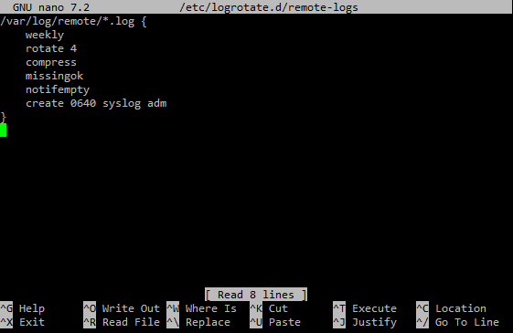

<br>

### Log file name reference

| Device | Source IP | Log File |
|--------|-----------|----------|
| L3-Multilayer-SW1 | 172.16.0.130 | 172.16.0.130.log |
| L3-Multilayer-SW2 | 172.16.0.131 | 172.16.0.131.log |
| L2-SW1 | 192.168.99.4 | 192.168.99.4.log |
| L2-SW2 | 192.168.99.5 | 192.168.99.5.log |
| L2-SW3 | 192.168.99.6 | 192.168.99.6.log |
| Ubuntu-Infra-Server | 172.16.0.5 | 172.16.0.5.log |
| Ubuntu-Admin-PC | 192.168.99.10 | 192.168.99.10.log |
| pfSense | 192.168.245.2 | 192.168.245.2.log |

<br>

## Configuring Syslog on All Switches

All five switches will be configured to send log messages to the Monitoring Server. We will configure the switches to only send warning messages and above for important events.

### L3-Multilayer-SW1

```
enable
configure terminal

logging host 172.16.0.135
logging trap warnings
exit
write
```
**Note:** I will only show the example configuration of L3-Multilayer-SW1 since all of the devices have the same configuration.

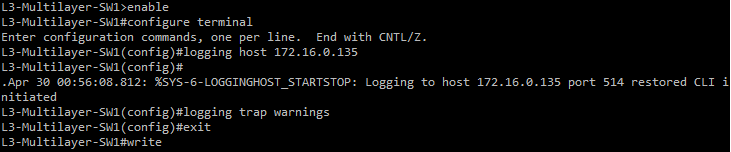

### L3-Multilayer-SW2

```
enable
configure terminal

logging host 172.16.0.135
logging trap warnings
exit
write
```

### L2-SW1

```
enable
configure terminal

logging host 172.16.0.135
logging trap warnings
exit
write
```

### L2-SW2

```
enable
configure terminal

logging host 172.16.0.135
logging trap warnings
exit
write
```

### L2-SW3

```
enable
configure terminal

logging host 172.16.0.135
logging trap warnings
exit
write
```

### Verify syslog configuration

To verify the switches are syncing to Ubuntu-Mon-Server, we can check the log files on Ubuntu-Mon-Server. Once the switch initiates the connection to the Monitoring Server, it sends a log and therefore creates a log file on the Monitoring Server. Ubuntu-Mon-Server should currently have logs for each switch configured.

To check this, on Ubuntu-Mon-Server, run the command
```
ls /var/log/remote
```
The output should show a created log file for each switch.

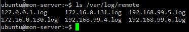

<br>

## Configuring Syslog on Ubuntu-Infra-Server and Ubuntu-Admin-PC

Ubuntu-Infra-Server and Ubuntu-Admin-PC need to send log messages to Ubuntu-Mon-Server.

### Ubuntu-Infra-Server

To be able to forward log messages to Ubuntu-Mon-Server, we need to first install rsyslog then make a configuration file on Ubuntu-Infra-Server.

To install rsyslog, use the commands:
```
sudo apt update
sudo apt install rsyslog -y
```

Then to make the configuration file, use the command:
```
sudo nano /etc/rsyslog.d/forwarding.conf
```

Then add:
```
*.warn @172.16.0.135:514
```
Then save with Ctrl+X, then y, then enter.

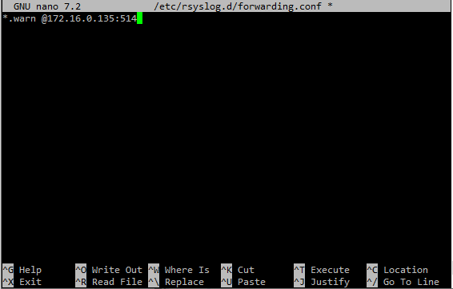

Then restart rsyslog using the command:
```
sudo systemctl restart rsyslog
```

### Ubuntu-Admin-PC

We now need to do the same for Ubuntu-Admin-PC.

Install rsyslog using the commands:
```
sudo apt update
sudo apt install rsyslog -y
```
**Note:** If it shows an 'unmet dependencies' error, run sudo apt --fix-broken install -y first.

Then make the forwarding configuration file using the command:
```
sudo nano /etc/rsyslog.d/forwarding.conf
```

Then add:
```
*.warn @172.16.0.135:514
```
Then save with Ctrl+X, then y, then enter.

Now restart rsyslog using the command:
```
sudo systemctl restart rsyslog
```

**Note:** You can run the command `logger -p user.warn "Test warning message from admin-pc"` on Ubuntu-Admin-PC to send a warning log to Ubuntu-Mon-Server so it appears under /var/log/remote.

<br>

## Configuring Syslog on pfSense

Now we can configure pfSense to send all firewall logs to Ubuntu-Mon-Server

In the pfSense webConfigurator:
- Go to Status → System Logs → Settings
- Check Enable Remote Logging
- Enter 172.16.0.135 in the Remote log servers field
- Under Remote Syslog Contents, check Firewall Events
- Leave all other options unchecked
- Click Save

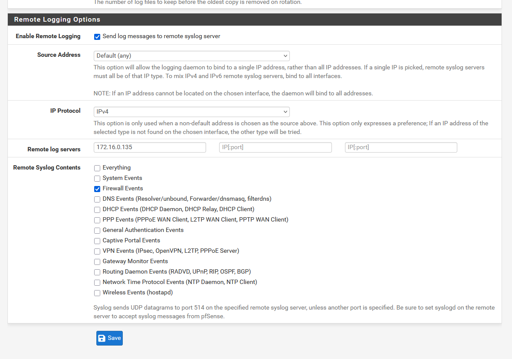

<br>

## Verification

Now that SNMP and Syslog have been configured, we can verify their functionality.

### Verify SNMP

We can verify SNMP by polling a switch to gather data from them. We will poll L3-Multilayer-SW1. First we must install files to allow name-based OIDs to poll with.

Install the files with the command:
```
sudo apt install snmp-mibs-downloader -y
```

Then edit the snmp.conf file to enable them using the command:
```
sudo nano /etc/snmp/snmp.conf
```
At the beginning of the line that says "mibs :" put a #:
```
# mibs :
```
Save with Ctrl+X, then y, then enter.

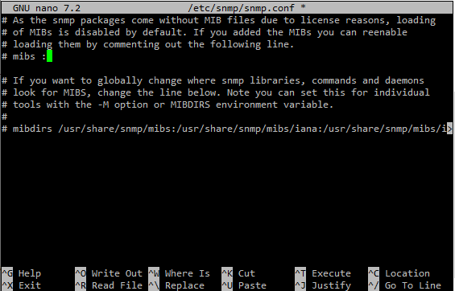


**Poll system uptime:**

On Ubuntu-Mon-Server, run the command:
```
snmpget -v2c -c ecorpSNMP 192.168.99.2 sysUpTime.0
```

**Poll hostname**

Run the command:
```
snmpget -v2c -c ecorpSNMP 192.168.99.2 sysName.0
```

**Poll interface list**

Run the command:
```
snmpwalk -v2c -c ecorpSNMP 192.168.99.2 ifDescr
```

A successful return on these commands shows SNMP is working correctly.

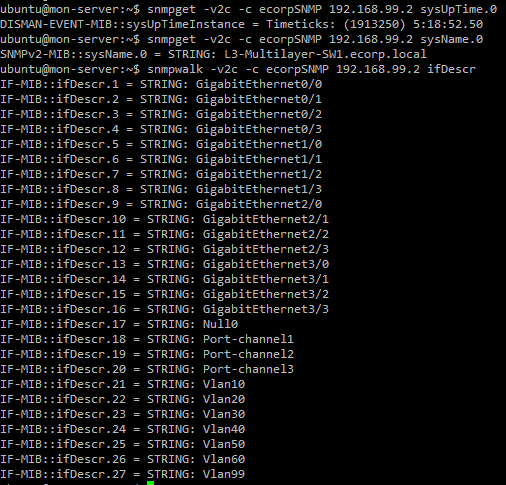

### Verify Syslog

We can send a syslog event by shutting down an unused interface and bringing it back up on L3-Multilayer-SW1.

On L3-Multilayer-SW1, run the commands:
```
enable
configure terminal

interface Gi3/2
no shutdown
shutdown
exit
```

Then we can check to see if the log was received by Ubuntu-Mon-Server.

On Ubuntu-Mon-Server, run the command:
```
sudo cat /var/log/remote/172.16.0.130.log
```
The result should show that interface state change in the log.

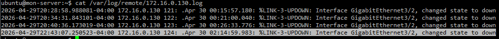

<br>

## Common Problems

| Problem | Fix |
|---------|-----|
| No storage space left on ubuntu server | Run `sudo apt clean` then run the desired command again. |
| Unmet dependencies error | Run `sudo apt --fix-broken install -y` then run the desired command again |
| snmpd does not start | Check the configuration file for any errors using `sudo nano /etc/snmp/snmpd.conf`. If there are incorrect values in the file fix them and then restart using the command `sudo systemctl restart snmpd`. |
| No log files are appeaering in /var/log/remote | Update the file permissions for the directory by running `sudo chown -R syslog:adm /var/log/remote` and `sudo chmod 755 /var/log/remote`. |


