# Firewall and ACL rules

Firewall rules and ACL (Access Control List) rules will work together to provide control over traffic flow in the network. Together, they will control how each VLAN in the network communicates. The firewall rules will control the traffic between the internal network and the internet, and the ACL rules will control traffic inside the internal network.

This section will cover the traffic rules, replacing the temporary firewall rules with specific rules, configuring ACLs on L3-Multilayer-SW1 and L3-Multilayer-SW2, and verifying the rules are working correctly.

<br>

## ACL and Firewall Rule Summary

This design provides isolation of department VLANs, access to the internet, control over inter-VLAN communication, access to necessary services and routing protocols, and control over ICMP traffic to restrict unnecessary pings from department VLANs and allow necessary troubleshooting pings for IT, Management, and servers. As this is a lab environment, this is a very simple version of the rules required. Production environments would require more complex rule sets for security.

<br>

| Source | Internet | Other Departments | Servers (DNS/NTP/HTTP) | Server SSH | Admin PC | IT/Management VLANs | ICMP |
|--------|----------|-------------------|------------------------|------------|----------|---------------|------|
| Department VLANs 10/20/30 | Allow | Deny | Allow | Deny | Deny | Deny | Echo-reply to VLAN 40,99 only |
| IT VLAN 40 | Allow | Allow | Allow | Allow | Allow | Allow | Allow all |
| Management VLAN 99 | Allow | Allow | Allow | Allow | N/A | Allow | Echo only |
| Server VLAN 50/60 | Allow | N/A | N/A | N/A | N/A | N/A | Allow all (troubleshooting) |

<br>

## Replacing Temporary Firewall Rules With Specific Rules

The temporary allow all rules that were applied in section 08 need to be updated to more specific rules so we can control traffic between the internal network and the internet.

<br>

Log into pfSense webConfigurator using the default credentials:

**Note:** You should change these credentials for security but for lab purposes leaving them default is fine.

Username: admin

Password: pfsense

### Delete temporary allow all rules

- Go to Firewall → Rules → L3MULTILAYERSW2LINK
- Click on the rule then click Delete to remove the allow all rule
- Click Apply Changes
- Go to L3MULTILAYERSW1LINK
- Click on the rule then click Delete to remove the allow all rule
- Click Apply Changes

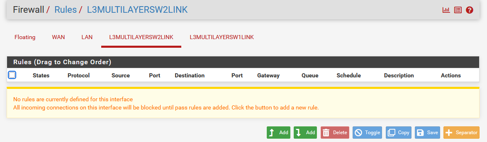

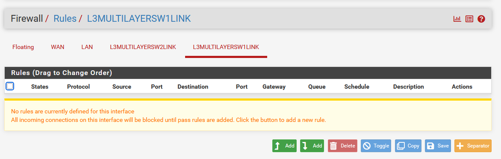

### Add specific rules for L3MULTILAYERSW2LINK and L3MULTILAYERSW1LINK

Go to Firewall → Rules → L3MULTILAYERSW2LINK

Add these rules in order by clicking the Add button with the down arrow for each rule:

**Rule 1 - Allow OSPF:**

- Action: Pass
- Protocol: OSPF
- Source: Any
- Destination: Any
- Description: Allow OSPF
- Leave others as default
- Click Save

**Rule 2 - Allow OSPF Multicast 224.0.0.5:**
  
- Action: Pass
- Protocol: Any
- Source: Any
- Destination: Address or Alias then type 224.0.0.5 in the Destination Address box
- Description: Allow OSPF Multicast 224.0.0.5
- Leave others as default
- Click Save

**Rule 3 - Allow OSPF Multicast 224.0.0.6:**

- Action: Pass
- Protocol: Any
- Source: Any
- Destination: Address or Alias then type 224.0.0.6 in the Destination Address box
- Description: Allow OSPF Multicast 224.0.0.6
- Leave others as default
- Click Save

**Rule 4 - Allow pfSense NTP:**

- Action: Pass
- Protocol: UDP
- Source: Address or Alias then type 10.0.0.5 in the Source Address box
- Destination: Address or Alias then type 172.16.0.5 in the Destination Address box
- Destination Port Range: from NTP (123) to NTP (123)
- Description: Allow pfSense NTP to Infra Server
- Leave others as default
- Click Save

**Rule 5 - Allow pfSense DNS:**

- Action: Pass
- Protocol: TCP/UDP
- Source: Address or Alias then type 10.0.0.5 in the Source Address box
- Destination: Address or Alias then type 172.16.0.5 in the Destination Address box
- Destination Port Range: from DNS (53) to DNS (53)
- Description: Allow pfSense DNS to Infra Server
- Leave others as default
- Click Save

**Rule 6 - Allow pfSense Syslog:**

- Action: Pass
- Protocol: UDP
- Source: Address or Alias then type 10.0.0.5 in the Source Address box
- Destination: Address or Alias then type 172.16.0.135 in the Destination Address box
- Destination Port Range: from Syslog (514) to Syslog (514)
- Description: Allow pfSense Syslog to Mon server
- Leave others as default
- Click Save

**Rule 7 - Allow Internal Subnets to Internet:**

- Action: Pass
- Protocol: Any
- Source: Network then type 192.168.0.0 in the Source Address box and choose /16
- Destination: Any
- Description: Allow Internal Subnet Internet Access
- Leave others as default
- Click Save

**Rule 8 - Allow Servers to Internet (for future package installation):**

- Action: Pass
- Protocol: Any
- Source: Network then type 172.16.0.0 in the Source Address box and choose /16
- Destination: Any
- Description: Allow Servers Internet Access
- Leave others as default
- Click Save

After adding all rules in order, click Apply Changes.

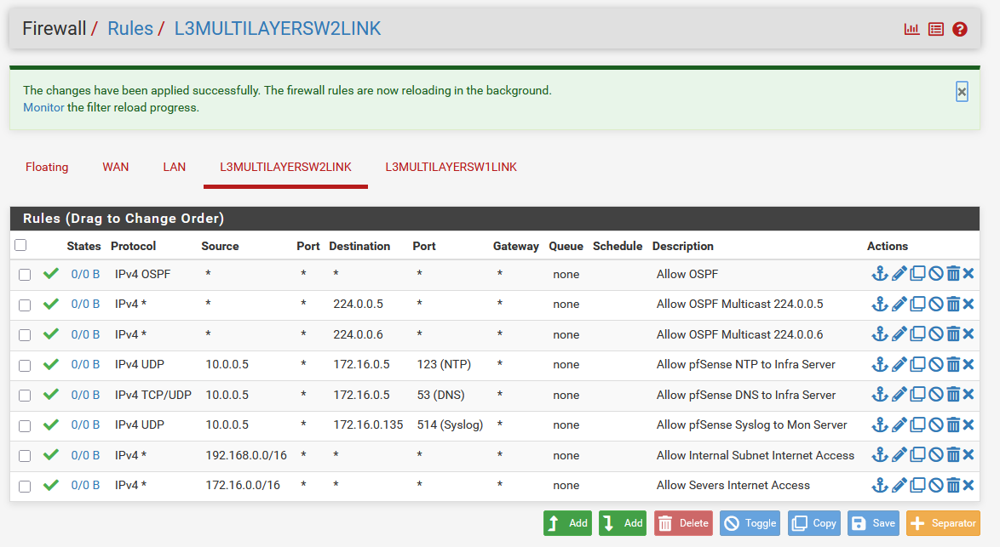

Then go to Firewall → Rules → L3MULTILAYERSW1LINK and add these rules in order:

**Rule 1 - Allow OSPF:**

- Same values as the previous Rule 1.

**Rule 2 - Allow OSPF Multicast 224.0.0.5:**
  
- Same values as the previous Rule 2.

**Rule 3 - Allow OSPF Multicast 224.0.0.6:**

- Same values as the previous Rule 3.

**Rule 4 - Allow pfSense NTP:**

- Action: Pass
- Protocol: UDP
- Source: Address or Alias then type 10.0.0.1 in the Source Address box
- Destination: Address or Alias then type 172.16.0.5 in the Destination Address box
- Destination Port Range: from NTP (123) to NTP (123)
- Description: Allow pfSense NTP to Infra Server
- Leave others as default
- Click Save

**Rule 5 - Allow pfSense DNS:**

- Action: Pass
- Protocol: TCP/UDP
- Source: Address or Alias then type 10.0.0.1 in the Source Address box
- Destination: Address or Alias then type 172.16.0.5 in the Destination Address box
- Destination Port Range: from DNS (53) to DNS (53)
- Description: Allow pfSense DNS to Infra Server
- Leave others as default
- Click Save

**Rule 6 - Allow pfSense Syslog:**

- Action: Pass
- Protocol: UDP
- Source: Address or Alias then type 10.0.0.1 in the Source Address box
- Destination: Address or Alias then type 172.16.0.135 in the Destination Address box
- Destination Port Range: from Syslog (514) to Syslog (514)
- Description: Allow pfSense Syslog to Mon server
- Leave others as default
- Click Save

**Rule 7 - Allow Internal Subnets to Internet:**

- Same values as the previous Rule 7.

**Rule 8 - Allow Servers to Internet (for future package installation):**

- Same values as the previous Rule 8.

Then Apply Changes.

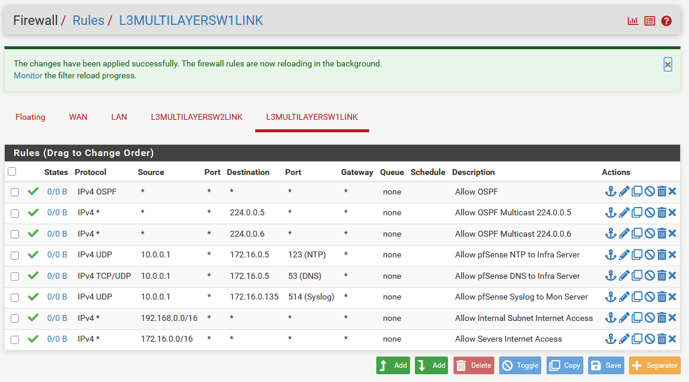

### Verify OSPF after changing rules

On both L3-Multilayer-SW1 and L3-Multilayer-SW2, verify OSPF is still forming an adjacency with pfSense.

Use the command:
```
enable

show ip ospf neighbor
```
pfSense should still apear as a FULL neighbor.

**L3-Multilayer-SW1:**

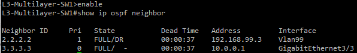

**L3-Multilayer-SW2:**

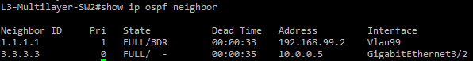

<br>

## Configuring ACLs on L3-Multilayer-SW1

ACLs are applied on each VLAN SVI to filter traffic as it enters the switch from the VLAN. Since both layer 3 switches can act as the sole switch in a failover scenario, the same ACLs must be applied to both layer 3 switches.

<br>

### VLAN 10 - HR (restricted)

```
enable
configure terminal

ip access-list extended VLAN10-IN

permit ospf any any
permit udp any host 224.0.0.102 eq 1985
permit icmp any 192.168.3.0 0.0.0.255 echo-reply
permit icmp any 192.168.99.0 0.0.0.255 echo-reply
deny icmp any any
permit tcp any any established
permit udp any host 172.16.0.5 eq 67
permit udp any host 172.16.0.5 eq 68
permit udp any host 172.16.0.5 eq 53
permit tcp any host 172.16.0.5 eq 53
permit udp any host 172.16.0.5 eq 123
permit tcp any host 172.16.0.5 eq 80
permit udp any host 172.16.0.135 eq 514
permit udp any host 172.16.0.135 eq 162
deny ip any 172.16.0.0 0.0.0.127
deny ip any 172.16.0.128 0.0.0.127
deny ip any host 192.168.99.10
deny ip any 192.168.0.0 0.0.0.255
deny ip any 192.168.1.0 0.0.0.255
deny ip any 192.168.2.0 0.0.0.255
deny ip any 192.168.3.0 0.0.0.255
permit ip any any

exit

interface Vlan10
ip access-group VLAN10-IN in
exit
do write
```

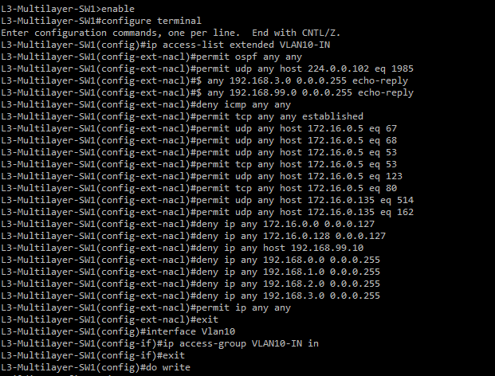

### VLAN 20 - Sales (restricted)

```
enable
configure terminal

ip access-list extended VLAN20-IN

permit ospf any any
permit udp any host 224.0.0.102 eq 1985
permit icmp any 192.168.3.0 0.0.0.255 echo-reply
permit icmp any 192.168.99.0 0.0.0.255 echo-reply
deny icmp any any
permit tcp any any established
permit udp any host 172.16.0.5 eq 67
permit udp any host 172.16.0.5 eq 68
permit udp any host 172.16.0.5 eq 53
permit tcp any host 172.16.0.5 eq 53
permit udp any host 172.16.0.5 eq 123
permit tcp any host 172.16.0.5 eq 80
permit udp any host 172.16.0.135 eq 514
permit udp any host 172.16.0.135 eq 162
deny ip any 172.16.0.0 0.0.0.127
deny ip any 172.16.0.128 0.0.0.127
deny ip any host 192.168.99.10
deny ip any 192.168.0.0 0.0.0.255
deny ip any 192.168.1.0 0.0.0.255
deny ip any 192.168.2.0 0.0.0.255
deny ip any 192.168.3.0 0.0.0.255
permit ip any any

exit

interface Vlan20
ip access-group VLAN20-IN in
exit
do write
```

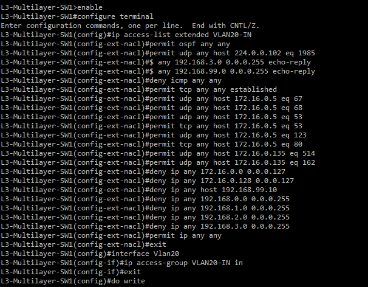

### VLAN 30 - Finance (restricted)

```
enable
configure terminal

ip access-list extended VLAN30-IN

permit ospf any any
permit udp any host 224.0.0.102 eq 1985
permit icmp any 192.168.3.0 0.0.0.255 echo-reply
permit icmp any 192.168.99.0 0.0.0.255 echo-reply
deny icmp any any
permit tcp any any established
permit udp any host 172.16.0.5 eq 67
permit udp any host 172.16.0.5 eq 68
permit udp any host 172.16.0.5 eq 53
permit tcp any host 172.16.0.5 eq 53
permit udp any host 172.16.0.5 eq 123
permit tcp any host 172.16.0.5 eq 80
permit udp any host 172.16.0.135 eq 514
permit udp any host 172.16.0.135 eq 162
deny ip any 172.16.0.0 0.0.0.127
deny ip any 172.16.0.128 0.0.0.127
deny ip any host 192.168.99.10
deny ip any 192.168.0.0 0.0.0.255
deny ip any 192.168.1.0 0.0.0.255
deny ip any 192.168.2.0 0.0.0.255
deny ip any 192.168.3.0 0.0.0.255
permit ip any any

exit

interface Vlan30
ip access-group VLAN30-IN in
exit
do write
```

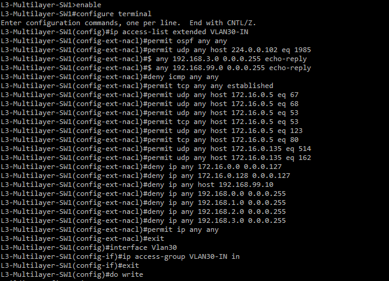

### VLAN 40 - IT (full access)

**Note:** For lab purposes, the IT department will have full access to devices and servers.

```
enable
configure terminal

ip access-list extended VLAN40-IN

permit ospf any any
permit udp any host 224.0.0.102 eq 1985
permit icmp any any
permit tcp any any established
permit udp any host 172.16.0.135 eq 514
permit udp any any eq 161
permit ip any any

exit

interface Vlan40
ip access-group VLAN40-IN in
exit
do write
```

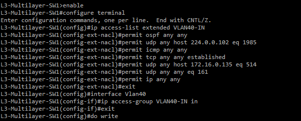

### VLAN 50 - Infrastructure Server

```
enable
configure terminal

ip access-list extended VLAN50-IN

permit ospf any any
permit udp any host 224.0.0.102 eq 1985
permit icmp any any
permit tcp any any established
permit udp host 172.16.0.5 eq 53 any
permit tcp host 172.16.0.5 eq 53 any
permit udp host 172.16.0.5 eq 123 any
permit udp any host 172.16.0.135 eq 514
permit udp any host 172.16.0.135 eq 162
permit udp host 172.16.0.5 host 172.16.0.135 eq 514
deny ip any any

exit

interface Vlan50
ip access-group VLAN50-IN in
exit
do write
```

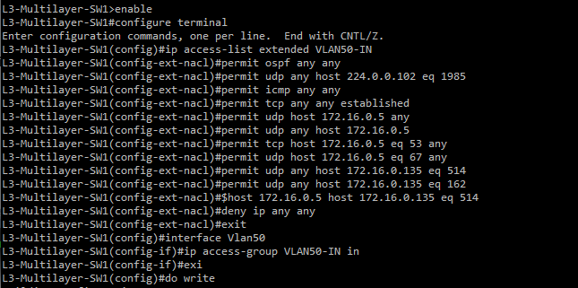

### VLAN 60 - Monitoring Server

```
enable
configure terminal

ip access-list extended VLAN60-IN

permit ospf any any
permit udp any host 224.0.0.102 eq 1985
permit icmp any any
permit tcp any any established
permit udp host 172.16.0.135 any eq 161
permit udp any host 172.16.0.135 eq 514
permit udp host 172.16.0.135 host 172.16.0.5 eq 53
permit udp host 172.16.0.135 host 172.16.0.5 eq 123
deny ip any any

exit

interface Vlan60
ip access-group VLAN60-IN in
exit
do write
```

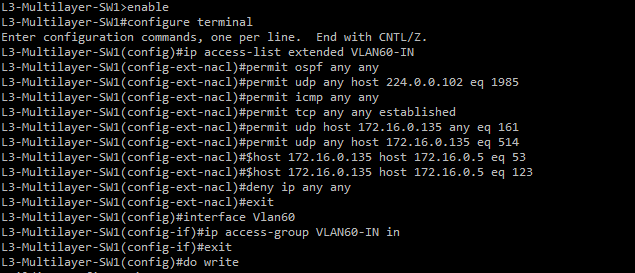

### VLAN 99 - Management (full access)

```
enable
configure terminal

ip access-list extended VLAN99-IN

permit ospf any any
permit udp any host 224.0.0.102 eq 1985
permit icmp any any echo
deny icmp any any echo-reply
permit icmp any any
permit tcp any any established
permit udp host 192.168.99.2 eq 161 host 172.16.0.135
permit udp host 192.168.99.3 eq 161 host 172.16.0.135
permit udp host 192.168.99.4 eq 161 host 172.16.0.135
permit udp host 192.168.99.5 eq 161 host 172.16.0.135
permit udp host 192.168.99.6 eq 161 host 172.16.0.135
permit udp any host 172.16.0.135 eq 514
permit ip any any

exit

interface Vlan99
ip access-group VLAN99-IN in
exit
do write
```

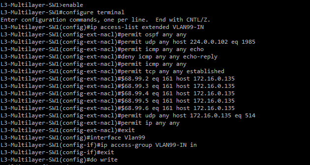

## Configuring ACLs on L3-Multilayer-SW2

L3-Multilayer-SW2 will have the exact same ACLs applied including names and rules. Both switches will need the same ACLs for normal operation and in case of a failover.

**Run all of the same commands as the previous step on L3-Multilayer-SW2** 

