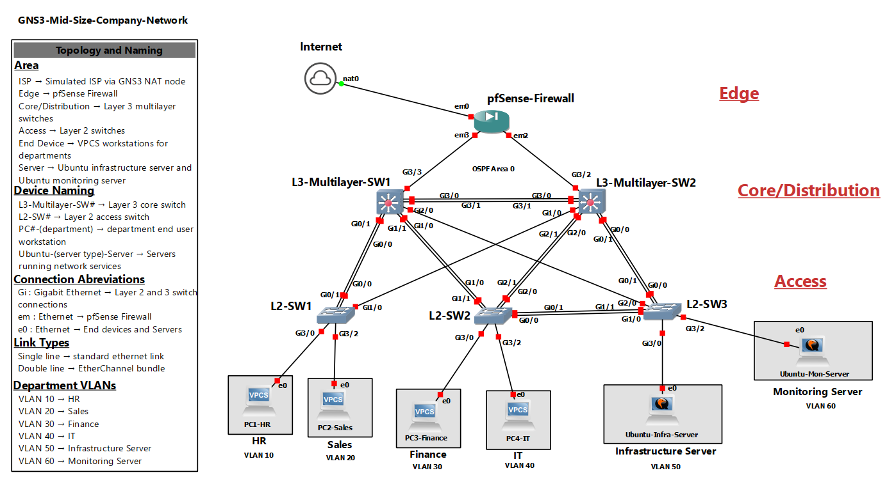

# Project1-GNS3-Mid-Size-Company-Network

 

## Project Overview

The scenario for this project is that a mid-size single site company with HR, Sales, Finance, and IT departments need a network designed with internal servers, secure segmentation, reliable routing, high availability, network monitoring, and a logging system. For this scenario, the external services such as public DNS, email, file storage, and internet are assumed be handled by third-party companies and are outside the scope of this lab. This lab is designed to give CCNA students a free lab to build and practice networking and virtualization skills on a simulated company network.

Every device in the lab except the NAT node requires full configuration. The NAT node is pre-configured through GNS3 and gives the devices NAT access. This lab is configured from the ground up, making it a valuable learning exercise for both myself and other CCNA students. 

## Network Overview

The topology uses a collapsed core/distribution design. It includes an edge layer with a pfSense firewall connecting to a simulated ISP, a core/distrubution layer with two redundant Layer 3 switches, and an access layer with three Layer 2 access switches connecting to end devices and two Ubuntu Linux servers handling internal services.

### Topology

### Protocols and Features

- **Routing:** OSPF - Single Area 0
- **High Availability:** HSRP - Active/Standby per VLAN group
- **Switching:** VLANs, Rapid PVST+, EtherChannel
- **Security:** ACLs, Port Security, pfSense Firewall Rules
- **Services:** DHCP, DNS, NTP, HTTP
- **Monitoring:** SNMP, Syslog

## Key Features

- **Routing Protocols:** OSPF is configured on both the edge layer and core/distribution layer to provide reliable routing.
- **High Availability:** HSRP is enabled per VLAN group. Both core switches actively forward traffic so no switch is idly standing by. L3-Multilayer-SW1 is the HSRP active gateway for VLANs 10, 20, and 30 while L3-Multilayer-SW2 is the active gateway for VLANs 40, 50, and 60 with each acting as a standby for the other. Each core device has redundant connections to other devices in case of a failure.
- **Segmentation:** Departments are segmented using VLANs with trunk ports on all switches.
- **Security:** pfSense firewall rules, ACLs, and port security are configured for traffic control across the network.
- **Internal Network Services:** DHCP, DNS, NTP, and HTTP on a linux server provide necessary infrastructure services on the internal network.
- **Monitoring Services:** SNMP and a Syslog provide monitoring for device statistics and a centralized logging system for devices.

## Tools Used

### Software

| Software | Version | Download |
|----------|---------|---------|
| GNS3 | 2.2.56.1 | [gns3.com](https://www.gns3.com) |
| GNS3 VM | 2.2.56.1 | [gns3.com](https://www.gns3.com) |
| VMware Workstation Pro 25H2 | 25.0.0.24995812 | [broadcom.com](https://www.broadcom.com) |

**Note:** The GNS3 software and GNS3 VM MUST be the same version otherwise the GNS3 VM will not work.

### Images

These images are required to run the lab. You must obtain them yourself from the official sources. For each of the images you will also need a GNS3 appliance file. The GNS3 appliance marketplace also has the official link to download the software images and the appliance requirements.

| Image | Source |
|-------|--------|
| Cisco IOSvL2 | [GNS3 Appliance / IOSvL2](https://gns3.com/marketplace/appliances/cisco-iosvl2) — requires a paid CML subscription |
| pfSense CE 2.7.2 | [GNS3 Appliance / pfSense CE 2.7.2](https://gns3.com/marketplace/appliances/pfsense) |
| Ubuntu Server (Noble Numbat) | [GNS3 Appliance / Ubuntu Server](https://gns3.com/marketplace/appliances/ubuntu-cloud-guest) |

**Importing the appliances:** To import the appliance, follow the tutorial [Here](https://docs.gns3.com/docs/using-gns3/beginners/import-gns3-appliance/) for each appliance.

### Hardware

| Component | Minimum |
|-----------|---------|
| RAM | 16GB |
| CPU | 4 cores with virtualization enabled (VT-x / AMD-V) |

**Note:** Virtualization (VT-x / AMD-V) must be enabled in your BIOS. The GNS3 VM will not run without it.

## Installing and Configuring GNS3 

### 1. Install GNS3 and the GNS3 VM

Download and install GNS3 and the matching GNS3 VM from [gns3.com](https://www.gns3.com). Import the GNS3 VM into VMware Workstation and configure it to use at least 8GB of RAM and 4 vCPUs.

### 2. Add the required images to GNS3

- **IOSvL2** — [Follow this tutorial](https://docs.gns3.com/docs/using-gns3/beginners/import-gns3-appliance/) - Requires 768MB of RAM with a telnet console
- **pfSense** — [Follow this tutorial](https://docs.gns3.com/docs/using-gns3/beginners/import-gns3-appliance/) - Requires 512MB of RAM with VNC console 
- **Ubuntu** — [Follow this tutorial](https://docs.gns3.com/docs/using-gns3/beginners/import-gns3-appliance/) - Requires 1024MB of RAM with telnet console

### 3. Import the project

- Clone or download this repository
- In GNS3, go to File → Open Project and select the `.gns3` project file

## License

This project is licensed under the MIT License. You are free to use, modify, and share this lab for personal or educational purposes. See [LICENSE](LICENSE) for details.
